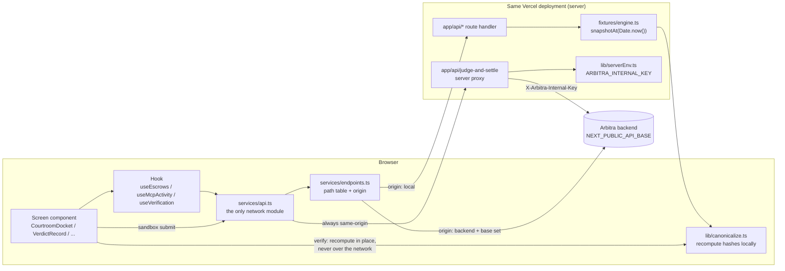
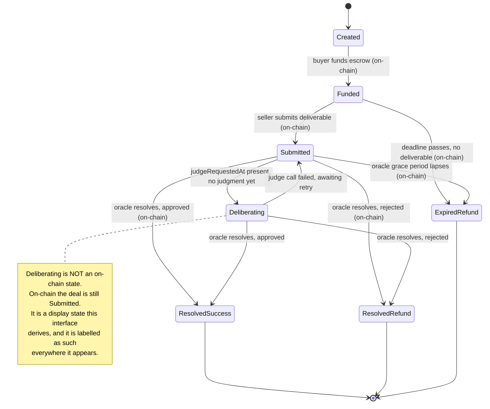

# Design Document: Arbitra Frontend

## Overview

Arbitra_Frontend is a Next.js App Router application that renders the protocol's record. It reads; it does not drive. Agents create and settle deals over MCP in a terminal on the left of a split screen, and this interface on the right proves what happened. That single fact sets every structural decision below: there is no write path in the required scope except the Injection_Sandbox, all state arrives by polling, and the highest-value code in the repository is a 120-line pure module that recomputes hashes in the visitor's own browser.

The application is organised around one seam and one asset.

The seam is `services/api.ts`. Every byte that arrives from outside the process crosses it. Above the seam sit hooks and components that never know whether they are reading fixtures or a live backend. Below it sits an endpoint table that decides, per path, whether the request goes to a Mock_API route handler in this same deployment or to the teammate's backend. Flipping from one to the other is an environment variable, not a refactor.

The asset is `lib/canonicalize.ts`. It is the client-owned port of the protocol's canonicalization and hashing. It has one third-party import (`ethers`), no React, no fetch, no environment reads, and no I/O. It is the module an auditor opens first, so it is written to be read: named intermediate values, an explicit field list, and no cleverness.

Everything else in this document is in service of those two things staying honest.

### Deviations recorded up front

- The package name stays `@arbiter/frontend`, not the README's `@arbitra/frontend`. Renaming a workspace package mid-monorepo breaks the other workspaces' references for no user-visible gain. The deviation is recorded in `frontend/README.md`.
- Source lives under `frontend/src/` (so `src/app/`, `src/components/`, `src/lib/`). Next.js supports this natively and it preserves the shape of the original structure sketch, which teammates will be looking for.
- The original sketch's `App.tsx` becomes `src/app/layout.tsx` plus `src/app/page.tsx`. Component filenames from the sketch are preserved verbatim so the README's file map still resolves.

## Architecture

### Directory layout

```
frontend/
  package.json                     # @arbiter/frontend, engines.node >=22, next scripts
  next.config.ts
  tailwind.config.ts
  tsconfig.json
  scripts/
    check-copy.mjs                 # banned-phrase gate (R13.6)
    check-design.mjs               # forbidden visual pattern gate (R14.6/8/9/10/11)
    check-bundle.mjs               # asserts the internal key is absent from client chunks (R11.5)
  docs/
    screen-checklist.md            # per-screen R14 review checklist (R14.12)
    backend-contract.md            # generated from types.ts, handed to the backend dev
  src/
    app/
      layout.tsx                   # fonts, Navbar, trust-boundary footer
      page.tsx                     # Docket (demo home)
      globals.css                  # @theme token layer only
      deals/[dealId]/page.tsx      # Verdict_Record + Verify_Panel
      agents/page.tsx              # Trust_Explorer list
      agents/[agent]/page.tsx      # agent detail
      agents/[agent]/resolutions/page.tsx   # metric drill-down target
      activity/page.tsx            # MCP_Activity_Feed
      sandbox/page.tsx             # Injection_Sandbox
      trust-model/page.tsx         # trust boundary statement
      api/
        deals/route.ts
        deals/[dealId]/route.ts
        verify/[dealId]/route.ts
        judgments/[dealId]/route.ts
        reputation/[agent]/route.ts
        agents/route.ts
        mcp-activity/route.ts
        judge/route.ts
        judge-and-settle/route.ts  # server proxy, reads ARBITRA_INTERNAL_KEY
    components/
      Navbar.tsx
      StatsOverview.tsx
      CourtroomDocket.tsx
      VerdictRecord.tsx
      VerifyPanel.tsx
      AgentExplorer.tsx
      McpActivityFeed.tsx
      InjectionSandbox.tsx
      primitives/
        MachineValue.tsx           # the only mono-rendering component
        StateChip.tsx
        EvidenceExhibit.tsx
        HashStripRow.tsx
        DocketEntry.tsx
        LogLine.tsx
        AgentRow.tsx
        VerdictBanner.tsx          # the only animated component
        DrillableMetric.tsx        # the only way to render a reputation number
        CopyAffordance.tsx
        EmptyState.tsx
        ErrorState.tsx
    hooks/
      usePolling.ts                # the shared primitive
      useEscrows.ts
      useAgentReputation.ts
      useMcpActivity.ts
      useVerification.ts
      useJudgeSubmission.ts
    lib/
      canonicalize.ts              # the client-owned port
      verify.ts                    # three-way comparison
      derive.ts                    # trust score, tiers, totals, dispute rates
      deriveState.ts               # Deliberating
      group.ts                      # docket partition
      formatMachine.ts             # truncation + copy payload
      format.ts                    # numbers, dates, USDC
      settlementLink.ts
      env.ts                        # NEXT_PUBLIC_* reads, one place
      serverEnv.ts                  # import 'server-only'; ARBITRA_INTERNAL_KEY
      errorCopy.ts                  # ApiError + contract errors -> copy
      guards.ts                     # runtime shape guards
    services/
      api.ts                       # the only network module
      endpoints.ts                 # the path table and origin routing
    fixtures/
      clock.ts                     # cycle-relative time
      timelines.ts                 # deal state timelines
      records.ts                    # verdict records, hashes computed at load
      agents.ts
      activity.ts
      engine.ts                     # Fixture_Engine entry point: snapshotAt(nowMs)
    content/
      copy.ts                       # every user-facing sentence, one module
    types.ts                        # Type_Spec, the backend contract
```

Rationale for `content/copy.ts`: Requirement 13 bans phrases and Requirement 16 demands specific error voice. Both are enforceable by a scanner only if copy is findable. Scattering sentences through JSX makes the gate a fuzzy grep; centralising them makes it exact. Components import named constants, so a banned phrase can only enter through one file, and the scanner still scans the whole corpus as a backstop.

### Data flow



Two things the diagram is asserting deliberately.

First, the arrow from the screen component straight to `lib/canonicalize.ts`. The recomputed column in Verify_Panel is produced in the browser from the preimage record, with no network hop. If that arrow ever routed through `services/api.ts`, the verification claim would collapse into "the backend told us it matched."

Second, the sandbox's arrow to `app/api/judge-and-settle` is unconditional. It is the only endpoint whose origin is never `backend`, because the request must be signed with a key the browser must never hold.

### Deal state machine



`Deliberating` needs an input the contract does not have: evidence that a judge call is in flight. The deal shape therefore carries `judgeRequestedAt?: string`, documented in `types.ts` as a field the backend must supply for the state to appear. Absent that field, `deriveDisplayState` returns `Submitted` and the Deliberating group renders its empty state. This is the honest degradation: the interface never guesses that a judge is running.

```ts
export function deriveDisplayState(deal: EscrowDeal, judgment: JudgmentRef | null): DisplayState {
  if (deal.state !== 'Submitted') return deal.state;
  if (!deal.judgeRequestedAt) return 'Submitted';
  if (judgment) return 'Submitted'; // judgment landed; oracle has not resolved yet
  return 'Deliberating';
}
```

## Components and Interfaces

### 1. The data-flow seam: `services/api.ts` and `services/endpoints.ts`

#### Base URL resolution

```ts
// services/endpoints.ts
function normaliseBase(raw: string | undefined): string {
  const trimmed = (raw ?? '').trim();
  if (trimmed === '') return '';                 // '' => same-origin => app/api/*
  return trimmed.replace(/\/+$/, '');            // strip trailing slashes so joins are single-slash
}

export const API_BASE = normaliseBase(process.env.NEXT_PUBLIC_API_BASE);
export const FORCE_BACKEND = process.env.NEXT_PUBLIC_API_BASE_ALL === '1';
```

`API_BASE === ''` means every path is requested relative to the current origin, which resolves to the Mock_API route handlers in the same deployment. No conditional, no separate mock client, no `if (isMock)` anywhere above the seam. That is the whole trick: the fallback is the empty string, and the browser's relative-URL resolution does the routing.

#### The endpoint table

The backend ships four routes today. Five more are specified but unbuilt. A single `API_BASE` switch would therefore break five screens the moment the backend comes online. The table resolves that:

```ts
type Origin = 'backend' | 'local';

export const ENDPOINTS = {
  health:      { path: () => `/health`,                              origin: 'backend' },
  judge:       { path: () => `/api/judge`,                           origin: 'backend' },
  reputation:  { path: (a: string) => `/api/reputation/${encodeURIComponent(a)}`, origin: 'backend' },
  judgment:    { path: (d: string) => `/api/judgments/${encodeURIComponent(d)}`,  origin: 'backend' },

  // Specified in types.ts, not yet shipped by the backend. Flip to 'backend' when it lands.
  deals:       { path: () => `/api/deals`,                           origin: 'local' },
  deal:        { path: (d: string) => `/api/deals/${encodeURIComponent(d)}`,      origin: 'local' },
  verify:      { path: (d: string) => `/api/verify/${encodeURIComponent(d)}`,     origin: 'local' },
  agents:      { path: () => `/api/agents`,                          origin: 'local' },
  mcpActivity: { path: () => `/api/mcp-activity`,                    origin: 'local' },

  // Never 'backend': the browser must not hold the internal key.
  judgeAndSettle: { path: () => `/api/judge-and-settle`,             origin: 'local', pinned: true },
} as const;

export function resolve(endpoint: Endpoint, ...args: string[]): string {
  const path = endpoint.path(...args);
  if (endpoint.pinned) return path;
  const useBackend = endpoint.origin === 'backend' || FORCE_BACKEND;
  return useBackend && API_BASE ? `${API_BASE}${path}` : path;
}
```

`NEXT_PUBLIC_API_BASE_ALL=1` forces every non-pinned endpoint at the backend, so Requirement 2.4 is satisfied literally — one environment variable, zero component edits — while the default keeps the demo alive against a partially-built backend. The alternative, a build-time flag per route or a `MOCK=1` switch, would either require nine flags or make the mock a mode rather than a fallback; a mode is something you can forget to leave.

Path templates are exactly the shipped shapes (`/health`, `/api/judge`, `/api/reputation/:agent`, `/api/judgments/:dealId`), and identifiers are encoded at the single point where they enter a path, so `agent-b` and `0xAbC…` and anything with a slash all round-trip.

#### The client never throws

```ts
export type ApiResult<T> = { ok: true; data: T } | { ok: false; error: ApiError };

async function request<T>(url: string, guard: Guard<T>, init?: RequestInit): Promise<ApiResult<T>> {
  let res: Response;
  try {
    res = await fetch(url, { ...init, headers: { accept: 'application/json', ...init?.headers } });
  } catch {
    return { ok: false, error: { kind: 'network', base: API_BASE } };
  }
  const body = await readJsonSafely(res);            // never throws; returns undefined on bad JSON
  if (!res.ok) return { ok: false, error: toApiError(res.status, body) };
  if (!guard(body)) return { ok: false, error: { kind: 'malformed', expected: guard.name } };
  return { ok: true, data: body };
}
```

Returning a result instead of throwing is the choice. The alternative — throwing typed errors — forces a `try/catch` in every hook and, worse, loses the discriminant at the catch site, where the value is `unknown`. With a result type, `errorCopy(error)` is total over the union and the compiler tells us when a new error kind has no copy. Every response is shape-guarded before it reaches a component, so a backend that ships a field rename produces a named `malformed` error instead of a runtime crash three components deep.

`AbortController` signals are threaded through `init.signal`; an aborted fetch is distinguished from a network failure and produces no state update at all.

### 2. `lib/canonicalize.ts` — the client-owned port

This module is deliberately boring. No React, no fetch, no `process.env`, no `Date.now()`. Its only import is `keccak256` and `toUtf8Bytes` from `ethers` v6. It is unit-testable in a bare Node process, which is why the test floor can be `node:test` with no DOM.

```ts
import { keccak256, toUtf8Bytes } from 'ethers';

export type Canonicalizable =
  | string | number | boolean | null
  | Canonicalizable[]
  | { [k: string]: Canonicalizable | undefined };

/** Deterministic string form: keys ascending, no whitespace, undefined members omitted. */
export function canonicalize(value: Canonicalizable | undefined): string {
  if (value === undefined) return 'null';           // only reachable at the root
  if (value === null) return 'null';
  if (typeof value === 'string') return JSON.stringify(value);
  if (typeof value === 'number') {
    if (!Number.isFinite(value)) throw new TypeError('canonicalize: non-finite number');
    return JSON.stringify(value);
  }
  if (typeof value === 'boolean') return value ? 'true' : 'false';
  if (Array.isArray(value)) return `[${value.map((v) => canonicalize(v ?? null)).join(',')}]`;

  const keys = Object.keys(value).filter((k) => value[k] !== undefined).sort();
  const members = keys.map((k) => `${JSON.stringify(k)}:${canonicalize(value[k])}`);
  return `{${members.join(',')}}`;
}

export function hashCanonicalValue(value: Canonicalizable | undefined): Hex32 {
  return keccak256(toUtf8Bytes(canonicalize(value))) as Hex32;
}
```

Notes on the choices, because each one is a place two implementations can silently disagree and produce a false tamper alarm:

- `Object.keys(...).sort()` uses the default lexicographic comparator on UTF-16 code units. This matches `Array.prototype.sort` in the backend's JavaScript. It is not locale-aware and must not become locale-aware; `localeCompare` would produce a different order for non-ASCII keys.
- Strings go through `JSON.stringify`, which yields the same escaping rules on both sides (`\uXXXX` for control characters, `"` and `\` escaped, no escaping of `/` or non-ASCII). Hand-rolling quoting here is the single most likely source of a cross-implementation mismatch.
- Arrays preserve order. Sorting them would be wrong: `acceptanceCriteria` is an ordered list and its order is part of the agreement.
- `undefined` inside an array becomes `null`, because arrays have no members to omit — omitting would change length, which is a semantic change.
- Non-finite numbers throw rather than serialising to `null`. A silent `NaN → null` would let two different records hash identically.

#### Deadline normalisation

```ts
export function normalizeDeadline(deadline: number | string): string {
  const date = typeof deadline === 'number' ? new Date(deadline * 1000) : new Date(deadline);
  if (Number.isNaN(date.getTime())) throw new TypeError(`normalizeDeadline: unparseable ${deadline}`);
  return date.toISOString();                        // always ...Z, always milliseconds
}
```

The contract stores a Unix-seconds `uint256`; the backend's judge record may carry either. Both must land on the same string or the verdict hash diverges between layers for a deal nobody tampered with. `toISOString()` is chosen because it is the one JavaScript date serialisation with a fixed shape (`YYYY-MM-DDTHH:mm:ss.sssZ`), so it is idempotent: feeding its own output back in reproduces it exactly.

#### The verdict payload: exactly seventeen fields

```ts
export const VERDICT_HASH_FIELDS = [
  'acceptanceCriteria', 'approved', 'buyer', 'deadline', 'dealId',
  'deliverable', 'deliverableHash', 'evaluationPrompt', 'modelId',
  'modelVersion', 'rawResponse', 'reasoning', 'rubricHash', 'score',
  'seller', 'taskCategory', 'verdict',
] as const;   // 17 fields. timestamp is NOT one of them.

export function buildVerdictPreimage(record: AuditableVerdict): VerdictPreimage {
  return {
    acceptanceCriteria: record.acceptanceCriteria,
    approved:           record.approved,
    buyer:              record.buyer,
    deadline:           normalizeDeadline(record.deadline),
    dealId:             record.dealId,
    deliverable:        record.deliverable,
    deliverableHash:    computeDeliverableHash(record),
    evaluationPrompt:   record.evaluationPrompt,
    modelId:            record.modelId,
    modelVersion:       record.modelVersion,
    rawResponse:        record.rawResponse,
    reasoning:          record.reasoning,
    rubricHash:         computeRubricHash(record),
    score:              record.approved ? 100 : 0,
    seller:             record.seller,
    taskCategory:       record.taskCategory,
    verdict:            record.approved ? 'PASS' : 'FAIL',
  };
}

export const computeRubricHash      = (r: Pick<AuditableVerdict, 'acceptanceCriteria'>) =>
  hashCanonicalValue(r.acceptanceCriteria);
export const computeDeliverableHash = (r: Pick<AuditableVerdict, 'deliverable'>) =>
  hashCanonicalValue(r.deliverable);
export const computeVerdictHash     = (r: AuditableVerdict) =>
  hashCanonicalValue(buildVerdictPreimage(r));
```

Building the preimage as an explicit literal rather than picking fields off the record with a loop is the choice, and it is worth defending. A loop over `VERDICT_HASH_FIELDS` would be shorter and would drift the moment a field's derivation changes. The literal makes four things visible on one screen: which fields are copied verbatim, which are recomputed (`rubricHash`, `deliverableHash`), which are derived from `approved` (`score`, `verdict`), and which is normalised (`deadline`). `timestamp`'s absence is visible by inspection. An auditor can check the seventeen against the specification by reading down the list. `VERDICT_HASH_FIELDS` still exists as the assertion target: a test parses the canonical string and compares its key set to the tuple, so the literal and the tuple cannot drift apart silently.

`score` and `verdict` are computed from `approved` rather than read from the record on purpose. If the backend ever stored `approved: true, score: 0`, reading both would produce a hash that matches nothing; deriving both means the preimage is internally consistent by construction and the inconsistency shows up as a stored-vs-recomputed mismatch, which is exactly what the Verify_Panel exists to surface.

### 3. Three-way verification: `lib/verify.ts`

Three sources, never merged:

| Column label in UI | Source | What it means |
| --- | --- | --- |
| Recomputed here | `lib/canonicalize.ts` run in this browser on the preimage from `GET /api/verify/:dealId` | What the record's own contents hash to |
| Backend record | `AuditableVerdict.rubricHash` / `.deliverableHash` / `.verdictHash` as stored | What the backend says it computed when it wrote the record |
| On-chain | `EscrowDeal.criteriaHash` / `.deliverableHash` / `.verdictReasoningHash` | What the contract committed and the oracle cannot retroactively edit |

Three rows (rubric, deliverable, verdict) times three columns. `criteriaHash` on the deal is the on-chain counterpart of `rubricHash`; the labels state that mapping in the row header rather than leaving the reader to infer it.

```ts
export type Hex32 = `0x${string}`;

export type TripleComparison =
  | { kind: 'all-match';         value: Hex32 }
  | { kind: 'stored-differs';    recomputed: Hex32; stored: Hex32; onChain: Hex32 }
  | { kind: 'onchain-differs';   recomputed: Hex32; stored: Hex32; onChain: Hex32 }
  | { kind: 'recomputed-differs';recomputed: Hex32; stored: Hex32; onChain: Hex32 }
  | { kind: 'all-differ';        recomputed: Hex32; stored: Hex32; onChain: Hex32 }
  | { kind: 'onchain-absent';    recomputed: Hex32; stored: Hex32; storedMatches: boolean };

export function compareTriple(recomputed: Hex32, stored: Hex32, onChain: Hex32 | null): TripleComparison {
  if (onChain === null) {
    return { kind: 'onchain-absent', recomputed, stored, storedMatches: eq(recomputed, stored) };
  }
  const rs = eq(recomputed, stored), ro = eq(recomputed, onChain), so = eq(stored, onChain);
  if (rs && ro) return { kind: 'all-match', value: recomputed };
  if (ro && !rs) return { kind: 'stored-differs',     recomputed, stored, onChain };
  if (rs && !ro) return { kind: 'onchain-differs',    recomputed, stored, onChain };
  if (so && !rs) return { kind: 'recomputed-differs', recomputed, stored, onChain };
  return { kind: 'all-differ', recomputed, stored, onChain };
}

const eq = (a: Hex32, b: Hex32) => a.toLowerCase() === b.toLowerCase();
```

Case analysis is exhaustive: with three values there are exactly five equality partitions (all equal; each one odd; all distinct), plus the absent-on-chain case for a deal not yet settled. Each named kind reports a pair by name:

```ts
export const DISAGREEING_PAIR: Record<Exclude<TripleComparison['kind'], 'all-match' | 'onchain-absent'>, string> = {
  'stored-differs':     'the backend record disagrees with both this browser and the chain',
  'onchain-differs':    'the chain disagrees with both this browser and the backend record',
  'recomputed-differs': 'this browser disagrees with both the backend record and the chain',
  'all-differ':         'all three sources disagree with each other',
};
```

Naming the odd-one-out rather than an arbitrary pair is more useful diagnostically, and it is what "name which pair disagrees" is for: `stored-differs` tells you the backend's stored hash is the suspect, because the browser recomputation and the immutable on-chain commitment agree with each other.

Hash-case is normalised in the comparison because a `0xABC…` from an RPC and a `0xabc…` from `keccak256` are the same commitment; treating them as a mismatch would be a false alarm. The display shows each value as returned, so the reader sees the raw data.

The conclusion:

```ts
export interface VerificationOutcome {
  rubric: TripleComparison;
  deliverable: TripleComparison;
  verdict: TripleComparison;
  conclusion: 'tamper-evident' | 'mismatch';
  /** Displayed as an input in its own labelled cell. NOT read when computing `conclusion`. */
  backendVerifiedFlag: boolean | null;
}

export function verifyRecord(preimage: VerifyPreimage, deal: EscrowDeal): VerificationOutcome {
  const rubric      = compareTriple(computeRubricHash(preimage),      preimage.rubricHash,      deal.criteriaHash);
  const deliverable = compareTriple(computeDeliverableHash(preimage), preimage.deliverableHash, deal.deliverableHash);
  const verdict     = compareTriple(computeVerdictHash(preimage),     preimage.verdictHash,     deal.verdictReasoningHash);
  const allMatch = [rubric, deliverable, verdict].every((c) =>
    c.kind === 'all-match' || (c.kind === 'onchain-absent' && c.storedMatches));
  return {
    rubric, deliverable, verdict,
    conclusion: allMatch ? 'tamper-evident' : 'mismatch',
    backendVerifiedFlag: preimage.verified ?? null,
  };
}
```

`backendVerifiedFlag` is assigned last and read nowhere. That is the structural enforcement of Requirement 8.7: the field is in the return type so the UI can display it, and there is no code path from it to `conclusion`. In the UI it appears in the hash strip carrying the `rule/excluded` token and the label "Backend's own assessment (not used above)".

The word "verified" appears in this application in exactly one place: that label. Successful comparisons are reported as **tamper-evident**, with the scope sentence adjacent: *"These three sources agree, so the stored record matches its hash. That is all this proves. It does not show what the model received, and it does not show that the model judged honestly."*

On a 404 from `GET /api/verify/:dealId`, the hook's `data` is untouched (see the polling contract below), so any previously computed columns stay on screen, and an `ErrorState` above them reads: *"The canonical preimage for this deal is not on record, so it cannot be recomputed here. The hashes below are the ones already fetched."*

### 4. Fixture_Engine: state as a pure function of absolute time

#### The clock decision

The obvious implementation is a module-load epoch:

```ts
const EPOCH_MS = Date.now();               // rejected
const elapsed = Date.now() - EPOCH_MS;
```

This is rejected. The Mock_API route handlers execute server-side. In `next dev` there is one Node process, so a module-load epoch would be stable and would even survive a full page reload, since the epoch lives on the server rather than in the page. But the target is Vercel, where each route handler invocation may land on a different serverless instance, each with its own module-load time. Two polls 2.5 seconds apart could hit instances whose epochs differ by minutes, and the docket would show deals jumping backwards through the state machine. On stage, a deal moving from `ResolvedSuccess` back to `Funded` reads as a bug in the protocol, not a bug in the fixtures.

The chosen implementation makes state a pure function of absolute wall-clock time, modulo a fixed cycle:

```ts
// fixtures/clock.ts
export const CYCLE_MS = 48_000;            // one full demo loop
export const STEP_MS  = 6_000;             // timeline granularity: 8 steps per cycle

/** Position within the current cycle. Identical on every process, every instance, forever. */
export function cyclePosition(nowMs: number = Date.now()): number {
  return nowMs % CYCLE_MS;
}
```

Consequences, stated explicitly because they are the ones a presenter will notice:

- **Across a full page reload:** state is unchanged, because it never depended on when the page loaded. Reloading mid-deliberation lands back in deliberation.
- **Across server/client boundaries:** the client never computes fixture state. Route handlers own the clock; components receive whatever states the response contains. Server and client clocks can differ by seconds without any visible effect, because there is no client-side recomputation to disagree with.
- **Across Vercel instances and cold starts:** identical, because `Date.now() % CYCLE_MS` is instance-independent. A cold start costs latency, not coherence.
- **The trade-off:** the timeline loops every 48 seconds. A resolved deal will return to `Funded`. Rather than hide this, the docket footer states it: *"Fixture deals cycle on a 48-second timeline. Set NEXT_PUBLIC_API_BASE to read live deals instead."* Honesty about the fixture is cheaper than a presenter being surprised by it. A monotonic alternative — seeding from `Date.now()` at build time via a baked constant — was considered and rejected: it goes stale, and a deployment two days before judging would show every deal expired.

#### Timelines

```ts
// fixtures/timelines.ts
export interface Step { atMs: number; state: EscrowState; judgeRequested?: boolean }

export interface FixtureDeal {
  base: Omit<EscrowDeal, 'state' | 'judgeRequestedAt'>;
  offsetMs: number;          // phase offset so deals are not synchronised
  steps: Step[];             // ascending atMs, first entry MUST be atMs: 0
}

/** The deal the demo watches: Funded -> Submitted -> Deliberating -> ResolvedSuccess. */
export const DEAL_ALPHA: FixtureDeal = {
  base: { /* dealId, buyer agent-b -> 0x…, seller agent-c -> 0x…, USDC, 250_000000, … */ },
  offsetMs: 0,
  steps: [
    { atMs: 0,      state: 'Funded' },
    { atMs: 12_000, state: 'Submitted' },
    { atMs: 18_000, state: 'Submitted', judgeRequested: true },   // renders as Deliberating
    { atMs: 30_000, state: 'ResolvedSuccess' },
  ],
};
```

Additional fixture deals cover `Created`, a `ResolvedRefund` path, and an `ExpiredRefund` path, each with a distinct `offsetMs`, so every docket group is populated at some point in the cycle and no group is permanently empty. Because `STEP_MS` is 6 seconds and the minimum gap between steps is 6 seconds, two polls more than 3 seconds apart can straddle a step boundary — Requirement 4.4's threshold with margin.

```ts
// fixtures/engine.ts
export function stateOf(deal: FixtureDeal, nowMs = Date.now()): { state: EscrowState; judgeRequestedAt?: string } {
  const pos = (cyclePosition(nowMs) + deal.offsetMs) % CYCLE_MS;
  const step = deal.steps.reduce((acc, s) => (s.atMs <= pos ? s : acc), deal.steps[0]);
  return {
    state: step.state,
    judgeRequestedAt: step.judgeRequested ? new Date(nowMs - 2_000).toISOString() : undefined,
  };
}

export function snapshotAt(nowMs = Date.now()): EscrowDeal[] { /* map over all fixture deals */ }
```

`snapshotAt` is the Fixture_Engine's whole public surface for the docket. Every mock route handler calls it with `Date.now()` and nothing else, which is what makes the engine testable: pass any `nowMs` and assert the result.

#### Real hashes, computed at load

Hand-written hash constants in fixtures are a trap. They cannot be verified by inspection, they go stale the moment a fixture's text changes by one character, and a Verify_Panel mismatch caused by a stale constant is indistinguishable from a mismatch caused by a real bug. So the fixtures compute their hashes with the same Canonicalizer the browser runs:

```ts
// fixtures/records.ts
import { computeRubricHash, computeDeliverableHash, computeVerdictHash } from '@/lib/canonicalize';

const RAW_RECORDS: RawVerdict[] = [ /* prompts, deliverables, model responses, reasoning */ ];

/** Sealed at module load. Same inputs -> same hashes, on every process. */
export const VERDICT_RECORDS: AuditableVerdict[] = RAW_RECORDS.map((raw) => {
  const record = {
    ...raw,
    score:   raw.approved ? 100 : 0,
    verdict: raw.approved ? ('PASS' as const) : ('FAIL' as const),
    rubricHash:      computeRubricHash(raw),
    deliverableHash: computeDeliverableHash(raw),
  };
  return Object.freeze({ ...record, verdictHash: computeVerdictHash(record) });
});
```

Cost is three keccak256 calls per record at module load — microseconds — in exchange for fixtures that are correct by construction and that stay correct when someone edits a deliverable's wording.

The on-chain values in the fixture deals are populated from the same computed hashes, so an untampered fixture produces `all-match` on all three rows. Requirement 4.5's three-way match is therefore a consequence of how the fixtures are built, not something maintained by hand.

The tampered record is produced by a named, reproducible mutation rather than a typed-in constant:

```ts
/** Flip the last nibble. A real hash, off by one character: a plausible single-byte corruption. */
export function tamper(hash: Hex32): Hex32 {
  const last = hash.slice(-1);
  return (hash.slice(0, -1) + (last === '0' ? '1' : '0')) as Hex32;
}

export const TAMPERED_RECORD: AuditableVerdict = Object.freeze({
  ...VERDICT_RECORDS[1],
  verdictHash: tamper(VERDICT_RECORDS[1].verdictHash),   // stored value only; on-chain stays correct
});
```

Only the stored value is corrupted; the on-chain value stays correct. The Verify_Panel therefore classifies it as `stored-differs` — the browser and the chain agree, the backend's record does not — which is the most instructive failure to show a reviewer, and the one the trust model predicts, since backend persistence is trusted infrastructure and the chain is not.

#### Reputation and agent identity fixtures

Matching the demo terminal output exactly:

| Agent | `agent` (string form) | Address form | totalJudged | successes | successRate | Trust score | Badge |
| --- | --- | --- | --- | --- | --- | --- | --- |
| Untrustworthy seller | `agent-b` | `0xB0b…` | 4 | 1 | 0.25 | 14 | Unproven |
| Reliable seller | `agent-c` | `0xC1c…` | 5 | 5 | 1.00 | 63 | Established |

Both forms of each identifier are present, because the MCP tool calls in the terminal use `agent-b` while the contract's `seller` field is an address. `GET /api/reputation/:agent` in the Mock_API resolves either form through `resolveAgentAlias()`, so a reviewer pasting either string into the URL gets the same record. The Trust_Explorer renders the string form as the primary identifier (untruncated) and the address as a secondary machine value (truncated), which is also the pair that exercises Requirement 7.5's two branches on every agent row.

### 5. Polling: `hooks/usePolling.ts`

#### The dependency decision

Plain `useEffect` plus a self-rescheduling `setTimeout`. Not `setInterval`, and not SWR or React Query.

`setInterval` is rejected on correctness grounds, not taste: it fires on a fixed schedule regardless of whether the previous request has settled. A 4-second response on a 2.5-second interval produces overlapping requests and out-of-order responses, which on a state-grouped docket means a deal visibly flickering between groups. A self-rescheduling timeout cannot overlap by construction, because the next timer is only armed in the `finally` of the previous request.

SWR and React Query are rejected on footprint. There are three polled call sites, no cache sharing between routes, no mutations to invalidate, no pagination, no optimistic updates, and no revalidate-on-focus requirement. Against that, `usePolling` is roughly forty lines that a reviewer can read in full — which matters more here than in a typical app, because this application's entire claim is that you can read what it does and check it. Adding a data-fetching library to a page about auditability, in order to save forty lines, is the wrong trade. The migration trigger is named so the decision is revisitable: adopt SWR if two routes need to share a cache entry, or if we add mutations that must invalidate reads.

#### The contract

```ts
export interface PollResult<T> {
  data: T | null;              // last successful payload; NEVER cleared by a later failure
  error: ApiError | null;      // last failure; cleared on the next success
  isFetching: boolean;         // a request is outstanding right now
  lastUpdatedAt: number | null;
  refetch: () => void;
}

export const POLL_INTERVAL_MS = 2_500;   // within [2000, 3000]

export function usePolling<T>(fetcher: (signal: AbortSignal) => Promise<ApiResult<T>>,
                              intervalMs = POLL_INTERVAL_MS): PollResult<T> { /* … */ }
```

Behaviour, each clause traceable to a requirement:

- **Prior data stays visible.** `data` is assigned only in the `ok: true` branch. There is no `setData(null)` anywhere in the module. A failure sets `error` and leaves `data` alone, so the docket keeps its rows and the Verify_Panel keeps its hashes.
- **Failures do not stop the loop.** The next timer is armed in a `finally`, so it is armed after success, after HTTP error, and after network failure alike. The only thing that stops the loop is unmount.
- **No overlap.** One outstanding request at a time by construction; a manual `refetch()` aborts the in-flight request before starting a new one.
- **Clean unmount.** A `cancelled` ref guards every `setState`, `clearTimeout` cancels the pending timer, and `AbortController.abort()` cancels the in-flight request. An abort is recognised and produces no state update, so unmounting mid-request never sets an error.
- **No backoff.** Deliberately: a fixed 2.5-second cadence through failures means the docket recovers within one tick of the backend coming back, which is the behaviour that matters when something is being restarted between demo runs. The failure is visible on screen the whole time, so a tight retry loop is not hiding anything.

Built on it:

```ts
export function useEscrows(): PollResult<EscrowDeal[]> & { groups: DocketGroups };
export function useMcpActivity(): PollResult<McpActivityEntry[]>;
export function useAgentReputation(agent: string): Omit<PollResult<ReputationSummary>, 'lastUpdatedAt'>;  // no polling
export function useVerification(dealId: string): { outcome: VerificationOutcome | null; error: ApiError | null; isVerifying: boolean; verify: () => void };
```

`useAgentReputation` does not poll. Reputation changes only when a deal resolves, and the explorer is a reading surface, not a live monitor; polling it would add requests with no informational gain. `useVerification` is user-triggered, per Requirement 8.1.

### 6. The injection sandbox server proxy

```ts
// src/lib/serverEnv.ts
import 'server-only';

export const serverEnv = {
  get internalKey(): string | null { return process.env.ARBITRA_INTERNAL_KEY?.trim() || null; },
  get backendOrigin(): string | null { return process.env.ARBITRA_BACKEND_ORIGIN?.trim() || null; },
};
```

```ts
// src/app/api/judge-and-settle/route.ts
import { serverEnv } from '@/lib/serverEnv';
import { keccak256, toUtf8Bytes } from 'ethers';
import { PRESETS } from '@/content/presets';

export const runtime = 'nodejs';
export const dynamic = 'force-dynamic';

export async function POST(req: Request) {
  const { presetId } = await req.json();                 // the ONLY field the client controls
  const preset = PRESETS.find((p) => p.id === presetId);
  if (!preset) return json(400, { error: 'Unknown preset', field: 'presetId' });

  const key = serverEnv.internalKey;
  if (!key) return json(401, { error: 'Server is not configured with settlement authorization',
                               envVar: 'ARBITRA_INTERNAL_KEY' });

  const body = {
    dealId: keccak256(toUtf8Bytes(`sandbox:${preset.id}:${Date.now()}`)),        // 32-byte hex, unique
    acceptanceCriteria: preset.acceptanceCriteria,                                // non-empty by construction
    deliverable: preset.deliverable,
    deadline: new Date(Date.now() + 3_600_000).toISOString(),                     // always one hour ahead
    buyer: preset.buyer, seller: preset.seller, taskCategory: preset.taskCategory,
  };

  const upstream = serverEnv.backendOrigin;
  if (!upstream) return json(200, simulateJudgement(preset));   // fixture verdict, labelled as such

  const res = await fetch(`${upstream}/api/judge-and-settle`, {
    method: 'POST',
    headers: { 'content-type': 'application/json', 'X-Arbitra-Internal-Key': key },
    body: JSON.stringify(body),
  });
  return json(res.status, await res.json());
}
```

The client sends a preset identifier, nothing else. Everything the backend validates is constructed server-side, which is how the three preconditions are satisfied and why they cannot be violated by a crafted request:

- **Future deadline.** Computed as `Date.now() + 1h` at request time, so it can never be stale. A baked constant would pass in development and fail as `InvalidDuration` a week later.
- **Non-empty acceptance criteria.** Sourced from the preset constant, which is typed as a non-empty tuple of non-empty strings and asserted at module load. The client cannot supply criteria at all, so it cannot supply empty ones.
- **bytes32 deal identifier.** `keccak256` of a UTF-8 string is exactly 32 bytes, non-zero for any input, and unique per submission because the timestamp is in the preimage — so repeated sandbox runs cannot collide into `DealAlreadyExists`.

#### Why the key cannot reach the client bundle

Four independent mechanisms, listed weakest to strongest:

1. **Next.js inlining rule.** Only `NEXT_PUBLIC_`-prefixed variables are substituted into client JavaScript. `process.env.ARBITRA_INTERNAL_KEY` in server code stays a server-side lookup. This is the framework guarantee, and on its own it is a convention that survives only as long as nobody adds a `NEXT_PUBLIC_` alias.
2. **`import 'server-only'`.** Importing `lib/serverEnv.ts` from any module in a client component's import graph is a build-time error with a named module in the message. This turns the convention into a compiler-enforced rule: the key is unreachable from the client, not merely un-inlined.
3. **Single read site.** `process.env.ARBITRA_INTERNAL_KEY` appears in exactly one file. `scripts/check-copy.mjs` asserts that count, so a second read site fails the build rather than being reviewed by luck.
4. **Bundle assertion.** `scripts/check-bundle.mjs` runs after `next build`, and when `ARBITRA_INTERNAL_KEY` is present in the build environment it greps every emitted file under `.next/static/` for the literal value and for the identifier string. Any hit exits non-zero. This is the one check that inspects the actual artefact rather than reasoning about it, which is why it exists despite the first three.

Nothing here depends on remembering a rule. Two of the four are enforced by the build.

Failure copy, per Requirement 11.6 and 11.7: a 401 renders *"This deployment has no settlement authorization, so the judge ran but nothing was settled. Set ARBITRA_INTERNAL_KEY on the server to enable settlement."* A 400 renders the backend's own `error` text verbatim, and when the response carries a `field` hint, the corresponding exhibit gets the `rule/tampered` accent and an inline note attributing the rejection to that field.

Concurrency, per Requirement 11.8: `useJudgeSubmission` keys in-flight state by preset id. While `pending.has(preset.id)`, the preset's control is `aria-disabled` with `aria-busy="true"`, and the submit handler returns early. The other preset stays live, because a reviewer comparing honest against injection should not be blocked by the first request.

## Design System

The brief is a court record rendered for machines. That resolves to a specific set of decisions: paper rather than a dark app chrome, rules rather than cards, tabular figures rather than proportional, and structural devices that carry information rather than decorate. The section below is prescriptive because the failure mode is a generic dashboard, and generic dashboards happen when a design system is a list of colours instead of a list of meanings.

### Typefaces

Two families, both loaded through `next/font/google`, which downloads and self-hosts the files at build time. There is no request to a font CDN at runtime, and `next/font` emits a size-adjusted local fallback so the layout does not shift when the webfont paints.

```ts
// src/app/layout.tsx
import { Archivo, JetBrains_Mono } from 'next/font/google';

const grotesk = Archivo({
  subsets: ['latin'], display: 'swap', axes: ['wdth'],
  variable: '--font-grotesk',
});

const mono = JetBrains_Mono({
  subsets: ['latin'], display: 'swap',
  variable: '--font-mono',
});
```

**Archivo** for prose and interface text. It is a revival of the American grotesques used for mid-century forms, dockets, and newspaper agate — the exact typographic register of a record. Concretely it earns the slot on four counts: true tabular figures, so amount and score columns align without hacks; a large x-height that stays legible at the 11px and 13px steps the docket needs; a variable weight axis, so hierarchy comes from weight within one family instead of a second display face; and a width axis, used once, for the ruling step. Rejected alternatives: **Inter**, because it is the default of every product dashboard and reads as software chrome rather than record-keeping; **IBM Plex Sans**, which is the right register but is so tied to IBM's design language that it reads as a vendor system; **Space Grotesk**, whose quirky terminals read as startup marketing and would fight the seriousness of the content.

**JetBrains Mono** for Machine_Identity_Data only. Hashes are the thing readers actually compare character by character, so the selection criterion is disambiguation at small sizes: it has a slashed zero, a distinct `1`/`l`/`I`, and lowercase letters roughly 1.2× the height of typical monospace designs, which is why a 66-character keccak hash stays scannable at the 13px `record` step. Rejected: **JetBrains Mono's** obvious competitor **IBM Plex Mono** has a narrower lowercase and a less distinct zero; **Roboto Mono** has an ambiguous `0`/`O` pairing that is actively harmful when the content is hex.

Mono is restricted to `MachineValue`. That restriction is not a guideline: `MachineValue` is the only component that references `--font-mono`, and `scripts/check-design.mjs` fails the build if `font-mono` appears in any other file.

### Type scale

Eight named steps. Every text element takes its size from one of them; there is no arbitrary `text-[15px]` anywhere, and the design check greps for bracket-literal font sizes.

| Step | Token | Size | Line height | Weight | Tracking | Used for |
| --- | --- | --- | --- | --- | --- | --- |
| 1 | `caption` | 11px / 0.6875rem | 16px | 500 | +0.012em | Field labels, column headers, source labels |
| 2 | `meta` | 12px / 0.75rem | 18px | 400 | +0.006em | Recorded metadata, timestamps, footnotes |
| 3 | `record` | 13px / 0.8125rem | 20px | 400 | 0 | Docket rows, log lines, all machine values |
| 4 | `body` | 15px / 0.9375rem | 24px | 400 | 0 | Prose, exhibit bodies |
| 5 | `lede` | 18px / 1.125rem | 27px | 400 | −0.006em | One paragraph per screen, no more |
| 6 | `heading` | 21px / 1.3125rem | 28px | 600 | −0.010em | Exhibit and section headers |
| 7 | `screen` | 28px / 1.75rem | 32px | 600 | −0.016em | Screen titles |
| 8 | `ruling` | 52px / 3.25rem | 52px | 700 | −0.024em | **Reserved.** The PASS/FAIL word. Once. |

The gap between step 7 and step 8 is deliberate and load-bearing. There is no 34px or 40px step, so nothing can creep toward the ruling step by picking the size next to it. `ruling` also carries `font-stretch: 96%` via Archivo's width axis, slightly condensed, which is the only place the width axis is used in the application.

Below 480px, `screen` clamps to 24px and `ruling` to 40px via `clamp()`, which keeps a 52px word from forcing horizontal overflow at 375px.

### Colour

Paper and ink, not a dark theme. Near-black backgrounds appear exactly once, on the verdict banner, where they are the reward for reaching a ruling.

#### Surfaces and text

| Token | Value | Role |
| --- | --- | --- |
| `--paper` | `#F7F6F2` | Page background |
| `--paper-sunk` | `#EFEDE7` | Recessed wells: raw model response, log console |
| `--paper-raised` | `#FDFCF9` | Evidence exhibit bodies |
| `--ink` | `#14161A` | Body text, primary rules |
| `--ink-muted` | `#4A4F58` | Metadata text, excluded-field rules |
| `--hairline` | `#8C887C` | Within-record separators |
| `--ruling-ground` | `#101317` | Verdict banner background. Nowhere else. |
| `--ruling-ink` | `#FFFFFF` | Verdict banner text. Nowhere else. |

Measured contrast ratios, so the WCAG AA requirement is checkable rather than asserted:

| Pairing | Ratio | Threshold | Role |
| --- | --- | --- | --- |
| `--ink` on `--paper` | **16.8:1** | 4.5:1 | Body text |
| `--ink` on `--paper-raised` | **17.7:1** | 4.5:1 | Exhibit body text |
| `--ink-muted` on `--paper` | **7.6:1** | 4.5:1 | Metadata at the `meta` step |
| `--hairline` on `--paper` | **3.3:1** | 3:1 | Within-record separators (boundary) |
| `--ruling-ink` on `--ruling-ground` | **18.6:1** | 4.5:1 | The verdict word |

`--ruling-ground` earns its role by measurement: 18.6:1 is the highest ratio available in the application, and no pairing on paper exceeds 17.7:1. `--paper-raised` is `#FDFCF9` rather than pure white specifically to keep that inequality true — pure white would put exhibit body text at 18.1:1 and the ruling block would no longer be the highest-contrast surface. "Highest-contrast surface treatment" is therefore a number, not an opinion, and Requirement 8.9 is checkable by comparing two ratios.

`--hairline` was darkened from a conventional `#D8D5CC` (1.4:1) to `#8C887C` (3.3:1) specifically to clear the 3:1 boundary threshold. The visual consequence is intended: the rules read like a printed ledger rather than a soft dashboard divider.

#### State colours

Each state colour is an ink, not a highlight, and each is paired with a text label in every instance. Colour is never the sole carrier.

| State | Ink token | Value | Ratio on `--paper` | Tint | Label text |
| --- | --- | --- | --- | --- | --- |
| Settled, seller paid | `--state-paid` | `#1F5F3B` | **7.0:1** | `#E8F0EA` | "Settled — seller paid" |
| Settled, buyer refunded | `--state-refunded` | `#1D4E89` | **7.8:1** | `#E7EDF5` | "Settled — buyer refunded" |
| Deliberating | `--state-deliberating` | `#8A5B00` | **5.4:1** | `#F5EDDC` | "Deliberating — off-chain" |
| Expired | `--state-expired` | `#5A5346` | **7.0:1** | `#EDEBE5` | "Expired — refundable to buyer" |
| Hash mismatch | `--state-tampered` | `#9B1C1C` | **7.5:1** | `#F6E7E7` | "Mismatch" |

`StateChip` renders each as: a 3px left rule in the state ink, the tint as background, and the label in `--ink` at the `caption` step. Because the label is `--ink` on a pale tint, its contrast is ≥14:1 in every case (`--ink` on `#E8F0EA` measures 15.6:1, the tightest of the five), so the chip passes AA regardless of which state it carries, and a reader with any form of colour vision deficiency reads the same information from the text.

Refunded is blue rather than red on purpose. A buyer refund is a correct protocol outcome, not an error; colouring it as failure would editorialise. Red is reserved for the one thing that genuinely indicates something is wrong: a hash mismatch.

On `--ruling-ground`, state inks are not used — none of them clears 3:1 against it, and lightening them to compensate would produce exactly the neon-on-near-black pairing Requirement 14.6 forbids. Instead the verdict banner carries a 6px state rule along its top edge, sitting on `--paper`, where the ink measures 5.4:1 to 7.8:1 as a boundary. The banner's own text is white and states the outcome in words.

### Rules, borders, and dividers, each with a documented meaning

This is the strongest lever available for making the interface not generic, because it converts the most common decorative element in web design into the interface's primary information channel. A reader who learns five rule styles can then tell, at a glance and without reading a single label, which fields are inside the hashed preimage and which are not. Every token below has a meaning, and `check-design.mjs` plus the component-level tests assert that each is applied only where its meaning holds.

| Token | Appearance | Meaning | Applied to |
| --- | --- | --- | --- |
| `rule/hashed` | 2px solid `--ink`, left edge, 12px inset | "This value is bytes-for-bytes inside the hashed preimage." | The 17 verdict payload fields, wherever they render |
| `rule/excluded` | 1px dashed `--ink-muted`, left edge, 12px inset | "Recorded metadata. Not in the preimage." | `timestamp`, the backend `verified` flag, block number, gas |
| `rule/derived` | 1px dotted `--state-deliberating`, left edge, 12px inset | "Computed by this interface. Not read from the protocol." | Trust score, badge tier, `totalUsdcSettled`, dispute rate, the Deliberating group header |
| `rule/boundary` | 3px solid `--ink`, then a 2px `--paper` gap, then 1px solid `--ink`, full width | "Trust boundary. Above: enforced by the contract. Below: trusted infrastructure." | Between the on-chain column group and the other two in the hash strip; between on-chain and off-chain sections of the verdict record; at the top of the trust-model statement |
| `rule/record` | 1px solid `--hairline`, full width of its container | "Same record, next field." | Between fields inside one exhibit or one hash strip |
| `rule/instance` | 1px solid `--ink`, full bleed | "End of one record, start of another." | Between docket entries, between agent rows |
| `rule/tampered` | 2px solid `--state-tampered`, left edge, 12px inset | "This value does not match its recomputation." | The specific hash strip row whose comparison is not `all-match` |

Two consequences worth naming.

The `rule/record` versus `rule/instance` distinction — hairline within a record, full ink between records — is what makes a dense list read as a ledger rather than a table. It is also information: a reader scanning the docket can see where one deal ends without reading any text, which is exactly the property a paper court docket has.

The `rule/boundary` double-rule is the only three-part rule in the system and it appears at most twice per screen. It is the visual statement of the trust model, and it is the one place where a structural device is doing argumentative work: the reader sees that the on-chain column is separated from the other two by a heavier line than anything else on the page.

Radius and shadow: `--radius-0: 0` everywhere except chips and buttons, which take `--radius-chip: 2px`. There are no box shadows in the application at all. Elevation is expressed by paper tone (`--paper-sunk` < `--paper` < `--paper-raised`) and rule weight. This is not minimalism for its own sake — a shadow implies a floating object, and a record is not a floating object.

### Container kinds

Six container primitives, differentiated structurally. No two share an identical token set, and there is no generic `Card`.

| Kind | Component | Structure |
| --- | --- | --- |
| **Evidence exhibit** | `EvidenceExhibit` | `--paper-raised`, radius 0, no shadow. Label at the `caption` step sits *inside* the top-left with a `rule/record` beneath it. Body at the `body` step, `max-width: 68ch`. Carries `rule/hashed` or `rule/excluded` on its left edge according to whether its field is in the preimage. Long machine content switches to `--paper-sunk` and the `record` step. |
| **Hash strip row** | `HashStripRow` | No box at all. A 4-track grid (row label, recomputed, backend, on-chain) at a fixed 40px row height, `record` step in mono, `rule/record` between rows, `rule/boundary` before the on-chain track, `CopyAffordance` at the end of each cell. The rows *are* the container. |
| **Docket entry** | `DocketEntry` | A 3-track ledger row (state chip, deal id + parties, amount + deadline), 48px min height, `rule/instance` between entries, no radius, no shadow. The whole row is a `next/link`. Pointer hover swaps the background to `--paper-sunk` instantly at 0ms — a state change, not an animation. Focus draws a 2px `--ink` outline at `-2px` offset. |
| **Log line** | `LogLine` | Inside a continuous `--paper-sunk` well with no separators between lines. 20px line height, a fixed 72px `caption`-step timestamp column, mono body, wrapped lines take a 2ch hanging indent so the timestamp column stays clean. Reads as a console transcript. |
| **Agent row** | `AgentRow` | Docket-entry geometry with a right-aligned numeric block whose every figure renders through `DrillableMetric`, each carrying `rule/derived`. Tabular figures so columns align down the list. |
| **Verdict banner** | `VerdictBanner` | The only dark block. Full bleed, `--ruling-ground`, 48px vertical padding, a 6px state rule along its top edge sitting on `--paper`, the PASS/FAIL word at the `ruling` step in `--ruling-ink`, outcome sentence at the `lede` step. Contains the application's single motion moment. |

### The one motion moment

**What it is.** When `VerdictBanner` first renders a settled verdict for a deal, the 6px state rule along its top edge draws from left to right: `transform: scaleX(0) → scaleX(1)`, `transform-origin: left`, 320ms, `cubic-bezier(0.2, 0, 0, 1)`. Simultaneously — meaning at t=0, not animated — the banner background steps from `--paper-sunk` to `--ruling-ground`. One animated property, `transform`, which is compositor-only and cannot cause layout work.

**Why this and not something else.** The rule drawing across the top of the block is the ruling being entered into the record. It is information-shaped motion: the thing that moves is the thing that carries the state. A fade-and-slide-up would be motion applied *to* the content, which says nothing and is explicitly forbidden. There is no opacity change and no translation anywhere in the application.

**Guards.** It fires once per mount, keyed to `dealId` via a ref, so a poll returning the same verdict does not replay it. It fires only on the absent-or-pending → settled transition, never on initial load of an already-settled deal reached by direct URL — arriving at a settled record from a link is not a verdict landing.

**Reduced motion.** Under `prefers-reduced-motion: reduce` the rule renders at full width immediately with `animation: none`. The state change is identical; only the 320ms is removed. In both cases the outcome sentence is announced through an `aria-live="polite"` region, so the information was never carried by the motion in the first place — the motion is a flourish on top of a change that is already legible.

`scripts/check-design.mjs` asserts that `animate-`, `transition-`, and `@keyframes` tokens appear in at most one component file, and that if they appear at all the file is `VerdictBanner.tsx`, with a narrow allowance for the `outline` transition on focus rings. The bound is "at most" rather than "exactly" so the gate can ship with the token layer and stay green until the banner exists.

### Where boldness is spent, measurably

The verdict record screen owns two things exclusively, and both are checkable:

1. **The `ruling` type step (52px).** It appears exactly once in the source: on the PASS/FAIL word inside `VerdictBanner`, which is rendered only within the ruling block of `/deals/[dealId]`. `check-design.mjs` asserts the string `text-ruling` occurs exactly once across `src/`.
2. **The highest-contrast surface (18.6:1).** `--ruling-ground` and `--ruling-ink` are referenced only by `VerdictBanner.tsx`, asserted by the same script. Every other surface pairing in the application tops out at 17.7:1.

Both assertions are implemented as upper bounds — at most one file, so zero passes — rather than equalities. The scanner ships with the token layer, well before `VerdictBanner.tsx` exists, and an equality rule would fail the build on every commit in between. The exactly-once state is confirmed once the banner lands, as its own step. `src/app/globals.css` is exempt from both rules and from the mono-confinement rule, because it is the file that declares those tokens; declaration is not use.

No other screen has a display-scale heading, an inverted surface, or an animation. `/`, `/agents`, `/activity`, and `/sandbox` all top out at the `screen` step on `--paper`. The restraint is what makes the verdict banner land; if the docket also had a dark hero, the ruling would just be another dark block.

### Explicitly forbidden, and how each is prevented

| Forbidden | Prevention |
| --- | --- |
| Glassmorphism | No `backdrop-blur`, `bg-white/10`, or `bg-opacity` tokens. `check-design.mjs` greps `backdrop-blur` and slash-opacity backgrounds. |
| Neon on near-black | Only one dark surface exists, and its only permitted foreground is `--ruling-ink` (white). Saturated inks are never placed on it. |
| Gradient washes as decoration | No `bg-gradient-*` utility appears in the codebase; the script greps for `gradient`. |
| Tracked-out ALL-CAPS eyebrow labels | Labels use the `caption` step at +0.012em, sentence case. The script greps for `uppercase` adjacent to `tracking-` and for `tracking-wide`/`tracking-widest`. |
| Arrow glyphs on buttons | Script greps button label constants in `content/copy.ts` for `→ ↗ » ›` and trailing `->`. |
| Middle-dot meta strings | Metadata renders as a `<dl>` of `caption` labels and `meta` values, never a joined string. The script greps for `' · '`, `" · "`, and `join(' · ')`. |
| Fade-and-slide-up entrances | No `opacity` or `translate` animation exists. Motion tokens are confined to one file, asserted above. |
| Hover animation on cards and lists | `DocketEntry` and `AgentRow` change background at 0ms. The script greps `hover:scale`, `hover:translate`, `hover:shadow`, and `transition-transform` in `primitives/` and screen components. |

Seven of the eight are machine-checked at build time, which is what makes them hold in week two.

### Per-screen review checklist

`frontend/docs/screen-checklist.md` holds a table of route × Requirement 14 criteria 1–11, with each cell marked `auto` (covered by `check-design.mjs`, naming the pattern) or `manual` (naming what to look at). A screen's work is not complete until its row is filled. Criteria 7 and 12 are the only fully-manual cells; everything else has at least a partial automated backstop, which keeps the checklist from becoming a ritual.

## Screens and Information Architecture

Layout is a 12-column grid with a 1200px max width and 24px gutters at ≥1024px, an 8-column grid at 768–1023px, and a single column below 768px. All machine values use `overflow-wrap: anywhere` so a 66-character hash wraps rather than pushing the page wide at 375px.

Every screen opens with a `screen`-step title and exactly one `lede`-step paragraph answering the two standing questions: what happened, and can I verify it.

### `/` — Courtroom docket (demo home)

The split-screen surface. Above the fold at 1024px: `StatsOverview` as a single row of four figures (deals settled, total USDC settled, dispute rate, agents indexed), each on `rule/derived`, each labelled "computed by this interface". Below it, `CourtroomDocket`.

Seven groups in on-chain lifecycle order: `Created`, `Funded`, `Submitted`, `Deliberating`, `ResolvedSuccess`, `ResolvedRefund`, `ExpiredRefund`. Each group is a `heading`-step header with a `StateChip` and a count, then its `DocketEntry` rows separated by `rule/instance`. Groups always render, even when empty, so a deal appearing in a group is a visible event rather than a layout reflow — this is the behaviour that makes the split screen readable when the terminal agent acts.

The `Deliberating` header carries `rule/derived` and the sentence: *"Off-chain state. On-chain these deals are still Submitted; a judge call is in flight."*

Each entry is a link to `/deals/{dealId}`. The docket footer names the fixture cycle when `NEXT_PUBLIC_API_BASE` is unset, and names `NEXT_PUBLIC_API_BASE` when a poll fails.

### `/deals/[dealId]` — Verdict record and verify panel

Three regions top to bottom, and within the first, three columns at ≥1024px.

**The evidence row.** Three equal columns, each an `EvidenceExhibit`: buyer acceptance criteria, seller deliverable, judge verdict. All three carry `rule/hashed`, because all three are in the preimage. At 768–1023px they become two columns with the verdict full-width beneath; below 768px they stack in that same order, because the reading order is the argument's order.

**The exhibits row.** Two `EvidenceExhibit`s with distinct accessible names, "Evaluation prompt, as sent to the model" and "Raw model response, unedited", both `rule/hashed`, both bodies on `--paper-sunk` at the `record` step because they are machine transcripts rather than prose. Then a third, `rule/excluded`: recorded metadata, holding `timestamp` and the sentence *"Recorded when the judgment was written. Excluded from the hashed payload, so two identical evaluations produce identical hashes."*

**The ruling block.** This is the region Requirement 8.9 refers to, and it is contiguous: `VerdictBanner`, then the hash strip, then `VerifyPanel`'s conclusion. It owns the `ruling` step and `--ruling-ground`.

The hash strip is four tracks: row label, "Recomputed here", "Backend record", "On-chain". `rule/boundary` separates the on-chain track from the other two. Three rows for the three hashes, then two metadata rows on `rule/record`: `modelId` with `modelVersion`, and the Settlement_Link. Below them, on `rule/excluded`, the backend's `verified` flag labelled "Backend's own assessment (not used above)". Any row whose comparison is not `all-match` takes `rule/tampered` and its differing cells get the `--state-tampered` ink plus a "Mismatch" chip.

`VerifyPanel` is user-triggered. Before activation the recomputed column reads "Not yet recomputed" and the control reads "Recompute hashes in this browser" — naming where the work happens is the point of the control. After it runs, the conclusion sits directly beneath the strip: **tamper-evident** or **mismatch**, followed by the scope sentence in both cases and, on mismatch, the `DISAGREEING_PAIR` sentence naming which source is the odd one out.

### `/agents` and `/agents/[agent]` — Trust explorer

**List.** A search input at the `body` step, then `AgentRow`s separated by `rule/instance`. Each row: identifier (string form untruncated, address form truncated beside it), trust score, badge tier chip, judgment count. Filtering is client-side over the full agent list — the list is small, the input should feel instant, and a network round trip per keystroke would be worse in every way. The match runs case-insensitively against the identifier, the address, and every task category name.

Standing copy above the list: *"This is the same reputation endpoint the MCP server queries before an agent decides whether to hire."* And beside the score column header: *"Trust score and badge tier are computed by this interface from the judgment history below, not read from the protocol."*

**Detail.** Header with both identifier forms. Then four regions: deal history (a `DocketEntry`-geometry list of resolutions), dispute rate by task category, recency-weighted reliability, total USDC settled. The first is protocol data; the other three carry `rule/derived`.

**Drill-down, and how the structure enforces it.** Requirement 6.5's real content is that a score you cannot open is an assertion. Two mechanisms, and the second is the one that holds.

The mechanism is a route, not a disclosure: `/agents/[agent]/resolutions?metric=<key>&category=<cat>`. A URL is itself evidence — it can be pasted into a bug report, linked from the README, and opened in a second tab beside the number it explains. An in-place disclosure cannot be cited. The route renders the resolution list the metric was computed from, plus the arithmetic: for `trustScore` it shows the recency-weighted reliability, the volume-confidence factor, and their product; for a dispute rate it shows the failures and the denominator; for `totalUsdcSettled` it shows the summed amounts.

The enforcement is that there is no way to render a reputation number without a destination. Every figure in the explorer goes through one primitive:

```tsx
interface DrillableMetricProps {
  label: string;
  value: string;
  /** Required. There is no variant of this component without a destination. */
  href: string;
  derived: true | { source: 'protocol' };
}

export function DrillableMetric({ label, value, href, derived }: DrillableMetricProps) { /* … */ }
```

`href` is a required prop with no default, and `resolutionsHref({ agent, metric, category })` is the only function that produces one. A developer who wants to display a bare number has to either add a prop to the primitive or bypass it, and the second is caught: `check-design.mjs` fails the build if a numeric-formatting helper from `lib/format.ts` is called inside `AgentExplorer.tsx` or `AgentRow.tsx` outside a `DrillableMetric` value expression. Enforcement by type signature first, by build check second.

**Zero-judgment empty state:** *"No resolutions on record for this agent. A trust score appears after this agent's first deal is judged and resolved by the oracle."*

### `/activity` — MCP activity feed

A continuous `--paper-sunk` well of `LogLine`s, newest first, polled at 2.5s. Each line is one row: fixed 72px timestamp column, then the querying agent, the queried agent, the returned reliability figure, the hiring decision, and the source label (`graph` or `backend`) as a `caption`-step chip at the right. Single line, no separators, no cards.

Three standing sentences above the well:

- *"A `backend` source label means this query fell back from The Graph to the backend index. The answer is the same; the path to it was different."*
- *"This feed shows reputation queries and the hiring decisions they produced. It does not assert that a subgraph deployment is currently serving them."*
- *"Prompts, rubrics, raw model responses, reasoning, and verdict hashes come from the off-chain AI Judge record, not from indexed on-chain data."*

Empty state: *"No reputation queries recorded yet. An entry appears when a buyer agent calls the reputation tool over MCP before hiring."*

### `/sandbox` — Injection sandbox

Two preset blocks stacked. Each is an `EvidenceExhibit` showing the full payload text — the injection preset's override sentence is shown verbatim, because hiding it would defeat the purpose — with a single control beneath: "Send to the judge". Activating it submits; there are no input fields on the screen.

While pending, the control is `aria-disabled` with `aria-busy`, its label reads "Judging…", and the other preset stays live. On return, a `VerdictBanner` renders in place directly beneath the payload it judged, followed by the verdict's reasoning and, when the backend supplied one, a link to the full `/deals/[dealId]` record.

Standing copy: *"The escrow contract is the trustless custody boundary. The language model, the backend that stores this record, and the oracle key that settles it are trusted infrastructure. This sandbox lets you probe the model directly."*

### `/trust-model` — the boundary statement

One page, opened by `rule/boundary`, stating what is contract-enforced and what is trusted, and what verification does and does not prove. Linked from the footer of every screen. It exists as a route rather than a modal because it is the claim the whole submission rests on and it should have a citable URL.

## Derived Metrics

Every figure below is computed by this interface or supplied by fixtures. Each is annotated in `types.ts` with a `@derived` block naming what the backend would need to ship for it to become protocol data, and each renders with `rule/derived` and visible interface copy saying so.

### Recency-weighted reliability

```ts
export function recencyWeightedReliability(history: JudgmentHistoryEntry[], nowMs = Date.now()): number {
  if (history.length === 0) return 0;
  let weighted = 0, total = 0;
  for (const h of history) {
    const ageDays = Math.max(0, (nowMs - Date.parse(h.resolvedAt)) / 86_400_000);
    const w = Math.exp(-ageDays / 30);
    total += w;
    if (h.approved) weighted += w;
  }
  return total === 0 ? 0 : weighted / total;
}
```

`exp(-ageDays / 30)` gives a judgment a weight of 1.0 today, 0.72 after 10 days, 0.37 after 30, and 0.037 after 90. A 30-day characteristic decay is chosen because agent behaviour and model versions change on roughly that timescale; a six-month-old success should not be presented as current evidence.

### Trust score

```ts
export const VOLUME_CONFIDENCE_K = 3;

export function trustScore(summary: ReputationSummary, nowMs = Date.now()): number {
  const r = recencyWeightedReliability(summary.history, nowMs);   // [0, 1]
  const n = summary.totalJudged;
  const confidence = n / (n + VOLUME_CONFIDENCE_K);               // [0, 1)
  return Math.round(100 * confidence * r);
}
```

The blend is multiplicative against a zero prior, not a shrink toward 0.5. That choice matters and it is worth stating why, because the conventional Bayesian move is the wrong one here. Shrinking toward 0.5 would give an agent with one failure and no successes a score near 50 — it would *flatter* an unproven agent by lending it the benefit of the doubt. In a hiring context that inverts the incentive: the score's whole job is to be the thing a buyer agent consults before spending money, so an absent record must read as absent, not as average. Trust is earned from zero.

Why low-sample agents cannot reach a high score, stated as a bound: with `r ≤ 1`, the score is capped at `100n / (n + 3)`.

| Judgments | Score ceiling |
| --- | --- |
| 1 | 25 |
| 4 | 57 |
| 5 | 63 |
| 10 | 77 |
| 27 | 90 |
| 57 | 95 |

A perfect record needs 27 resolutions to reach 90. `k = 3` is chosen to put that ceiling at a number a demo agent can plausibly approach while still making five-for-five obviously provisional.

The fixture agents land where the demo needs them: `agent-c` at 5/5 scores 63 (Established), and its detail view states *"Capped at 63 by 5 judgments. At this reliability, 27 judgments would reach Exemplary."* — which turns the cap into a legible feature rather than a mystery. `agent-b` at 1/4 scores 14 (Unproven), comfortably below anything a buyer would hire.

### Badge tiers

```ts
export const BADGE_TIERS = [
  { tier: 'Unproven',    min: 0,  max: 24  },
  { tier: 'Provisional', min: 25, max: 49  },
  { tier: 'Established', min: 50, max: 74  },
  { tier: 'Trusted',     min: 75, max: 89  },
  { tier: 'Exemplary',   min: 90, max: 100 },
] as const;

export function badgeTier(score: number, totalJudged: number): BadgeTier {
  if (totalJudged < 3) return 'Unproven';    // floor: three resolutions before any tier above the base
  return BADGE_TIERS.find((t) => score >= t.min && score <= t.max)!.tier;
}
```

The bands are contiguous and cover 0–100 with no gaps or overlaps, so every integer score maps to exactly one tier. The `totalJudged < 3` floor is a second guard on the same concern as the volume factor: with `k = 3`, two perfect judgments already score 40 and would otherwise read as Provisional, which overstates two data points.

### Totals and dispute rates

```ts
export function totalUsdcSettled(deals: EscrowDeal[]): bigint {
  return deals
    .filter((d) => d.state === 'ResolvedSuccess' || d.state === 'ResolvedRefund')
    .reduce((sum, d) => sum + BigInt(d.amount), 0n);
}

export function disputeRateByCategory(history: JudgmentHistoryEntry[]): Record<string, { rate: number; failures: number; total: number }>;
```

`amount` is a 6-decimal USDC integer carried as a string in the API and as `bigint` in arithmetic — never a JavaScript number, because 2^53 is reachable and a rounded settlement total on an audit surface would be indefensible. `ExpiredRefund` is excluded from `totalUsdcSettled` because no resolution occurred; the docket shows those amounts separately as "returned on expiry".

Dispute rate returns its numerator and denominator alongside the rate, so `DrillableMetric` can show `2 of 7` rather than `28.6%` alone, and the drill-down route can reproduce the arithmetic.

### Annotation format in `types.ts`

```ts
export interface ReputationSummary {
  agent: string;
  totalJudged: number;
  successes: number;
  failures: number;
  successRate: number;
  failureRate: number;

  /**
   * @derived frontend
   * Computed by lib/derive.ts from `history`. Not returned by any shipped backend route.
   * To move this server-side the backend must supply, per judgment: `approved` and
   * `resolvedAt` (ISO 8601, oracle resolution time, not judge time).
   */
  recencyWeightedReliability: number;

  byTaskCategory: Record<string, TaskCategoryStats>;
  history: JudgmentHistoryEntry[];
}
```

Each of the five Derived_Metrics — trust score, badge tier, `totalUsdcSettled`, dispute rate by task category, the agent list — carries a block in this shape. The agent list's block names the missing route explicitly: *"No shipped route enumerates agents. Fixture-backed. The backend would need `GET /api/agents` returning identifiers plus their alias forms; `GET /api/reputation/:agent` requires an identifier you already have."*

## Error Handling

### The result type

```ts
export type ApiResult<T> = { ok: true; data: T } | { ok: false; error: ApiError };

export type ApiError =
  | { kind: 'network';      base: string }
  | { kind: 'bad-request';  status: 400; message: string; field?: string }
  | { kind: 'unauthorized'; status: 401; envVar: 'ARBITRA_INTERNAL_KEY' }
  | { kind: 'not-found';    status: 404; resource: 'deal' | 'judgment' | 'preimage' | 'agent'; id: string }
  | { kind: 'server';       status: 500; message: string }
  | { kind: 'upstream';     status: 502; message: string }
  | { kind: 'unavailable';  status: 503; retryAfterMs?: number }
  | { kind: 'contract';     name: ContractErrorName; detail?: string }
  | { kind: 'malformed';    expected: string };
```

`errorCopy(error): { cause: string; recovery: string }` is total over the union. Because the union is closed and the function's return type is not optional, adding an error kind without copy is a compile error rather than an empty error panel.

### HTTP status mapping

| Status | Kind | Cause copy | Recovery copy |
| --- | --- | --- | --- |
| — (fetch threw) | `network` | "The backend at {base} did not answer." | "Check that `NEXT_PUBLIC_API_BASE` points at a running backend, or unset it to read fixture data from this deployment." |
| 400 | `bad-request` | The backend's own `error` text, verbatim. | "Correct the {field} and send it again." (Field named when the response carries one.) |
| 401 | `unauthorized` | "This deployment has no settlement authorization, so nothing was settled." | "Set `ARBITRA_INTERNAL_KEY` on the server and redeploy." |
| 404 | `not-found` | Per resource: "No judgment record exists for deal {id}." / "The canonical preimage for this deal is not on record." / "No deal is recorded under {id}." / "No reputation record exists for {id}." | "Check the identifier, or wait for the oracle to resolve this deal." |
| 500 | `server` | "The backend failed while handling this request." | "Retry. If it persists, the backend logs will name the failure; the interface cannot see them." |
| 502 | `upstream` | "The backend reached its upstream — the model provider or an RPC node — and got an error back." | "Retry. This is upstream of the interface and upstream of the backend." |
| 503 | `unavailable` | "The backend is up but not ready to serve this request." | "Retry in {retryAfterMs or 'a few seconds'}. Polling continues automatically." |
| any | `malformed` | "The backend answered, but the response did not match the shape {expected}." | "The backend and `types.ts` have drifted. `types.ts` is the contract." |

The recovery lines carry the interface's voice: they say what the reader can do, and where they cannot do anything they say so plainly rather than suggesting a retry that will not help. "The interface cannot see them" is doing real work — it tells a reviewer to stop looking at the browser.

### Contract errors

Surfaced when the backend relays a revert reason from a settlement attempt. `contractErrorCopy` maps all ten to distinct messages:

| Error | Message |
| --- | --- |
| `Unauthorized` | "Only the registered oracle can resolve a deal. The address that signed this call is not that oracle." |
| `InvalidAddress` | "An address in this call is the zero address or malformed. Buyer, seller, and token must all be non-zero addresses." |
| `InvalidAmount` | "The escrow amount must be greater than zero." |
| `InvalidDuration` | "The deadline is outside the range the contract accepts. It must be far enough in the future and within the contract's maximum term." |
| `InvalidDealId` | "A deal identifier must be 32 bytes of non-zero hex." |
| `DealAlreadyExists` | "A deal is already recorded under this identifier. Identifiers cannot be reused." |
| `InvalidState` | "This action is not available from the deal's current state. The deal is {current}; this action requires {required}." |
| `DeadlinePassed` | "The deadline has passed, so the seller can no longer submit a deliverable. The buyer can now claim a refund." |
| `DeadlineNotPassed` | "The deadline has not passed yet. A buyer refund becomes available once it does." |
| `OracleGracePeriodNotPassed` | "The oracle still has time to resolve this deal. A buyer refund becomes available once the grace period ends." |

`InvalidState` interpolates the current and required states when the backend supplies them in `detail`, and falls back to the sentence's first clause when it does not. Each message names the actor and the condition rather than restating the identifier — an error that only says `InvalidState` tells the reader nothing they did not already know.

Standing copy on the deal record and the docket, per Requirement 16.6: *"A buyer refund becomes available in two cases: the seller misses the deadline without submitting, or the oracle does not resolve the deal within its grace period after submission."*

### Empty states

Every empty state names the action that would populate the view. They live in `content/copy.ts` as a keyed table so the build check can assert every remote-reading route has one.

| Screen | Copy |
| --- | --- |
| Docket, all groups | "No deals on record. A deal appears here when a buyer agent funds an escrow over MCP." |
| Docket, one group | "None." (at the `meta` step, no illustration — an empty group is information, not a failure) |
| Verdict record | "No judgment record exists for this deal yet. One appears after the seller submits a deliverable and the judge evaluates it." |
| Verify panel, pre-run | "Not yet recomputed. Activate the control above to hash this record in your browser." |
| Trust explorer list | "No agents indexed. An agent appears here after its first judged deal." |
| Agent detail | "No resolutions on record for this agent. A trust score appears after this agent's first deal is judged and resolved by the oracle." |
| Resolutions drill-down | "No resolutions contribute to this figure yet." |
| MCP activity | "No reputation queries recorded yet. An entry appears when a buyer agent calls the reputation tool over MCP before hiring." |
| Sandbox | "No verdict yet. Send one of the two payloads above to the judge." |

### Loading states

Loading is a skeleton in the row geometry of the content it replaces — docket rows as `--paper-sunk` blocks at 48px, hash strip rows at 40px, log lines at 20px — never a spinner, and never with a pulse animation, since animation is confined to the verdict moment. A static tone block at the right height means the layout does not move when data lands, which is the same reason the docket renders empty groups.

Loading appears only on first load. Once `data` is non-null, subsequent polls show `isFetching` as a 1px `--ink` progress rule along the top of the polled region and nothing else. Replacing populated content with skeletons on every 2.5-second poll would make the docket unreadable.

## Trust-Model Copy Discipline and the Banned-Phrase Gate

### The scanner

```js
// frontend/scripts/check-copy.mjs
const BANNED = [
  { id: 'verified-inference', re: /verified\s+inference/gi,
    why: 'Arbitra does not perform verified inference. See requirements R13.2.' },
  { id: 'trustless-ai', re: /trust-?less\s+(ai|artificial\s+intelligence|arbitration|judge|judging|judgment|verdict|evaluation)/gi,
    why: 'The contract is the trustless boundary; the model is not. See R13.3.' },
  { id: 'ai-trustless', re: /\b(ai|model|judge|llm)\b[^.\n]{0,48}\btrust-?less\b/gi,
    why: 'Same claim in reverse word order. See R13.3.' },
  { id: 'live-subgraph', re: /(live|deployed)\s+subgraph|subgraph\s+is\s+(live|deployed|serving)/gi,
    why: 'No subgraph deployment is asserted. See R10.4.' },
  { id: 'arc-network', re: /\barc\s+(network|chain|testnet|mainnet)\b/gi,
    why: 'Sepolia only. See R12.5.' },
  { id: 'self-praise', re: /(fully|completely)\s+(accessible|responsive)|works\s+on\s+every\s+(device|screen)/gi,
    why: 'The interface does not announce its own accessibility. See R15.6.' },
  { id: 'hardcoded-escrow', re: /0x[0-9a-fA-F]{40}\b/g, exclude: [/^src\/fixtures\//],
    why: 'No hardcoded escrow address. Read NEXT_PUBLIC_ESCROW_ADDRESS. See R12.6.' },
  { id: 'internal-key-reads', kind: 'count', re: /ARBITRA_INTERNAL_KEY/g, max: 1,
    scope: [/^src\//], why: 'The internal key may be read in exactly one module. See R11.5.' },
];

const SCOPE = ['src/**/*.{ts,tsx,css}', 'scripts/**/*.mjs', 'docs/**/*.md', 'README.md'];
```

Scope is the `frontend/` workspace only. The spec documents under `.kiro/specs/` legitimately contain the banned phrases — this document contains several — and scanning them would make the gate unusable. Output is `path:line:col  [rule-id]  matched text  — why`, one line per hit, then a count, then `process.exit(1)`.

### Where it hooks in

```json
{
  "scripts": {
    "check:copy":   "node scripts/check-copy.mjs",
    "check:design": "node scripts/check-design.mjs",
    "check:bundle": "node scripts/check-bundle.mjs",
    "typecheck":    "tsc --noEmit",
    "prebuild":     "npm run check:copy && npm run check:design",
    "build":        "node scripts/check-copy.mjs && node scripts/check-design.mjs && next build && node scripts/check-bundle.mjs",
    "test":         "node --import tsx --test \"src/**/*.test.ts\""
  }
}
```

Both `prebuild` and `build` run the checks, and that redundancy is the point. `prebuild` covers `npm run build`, which is what Vercel invokes, so a banned phrase fails the deployment rather than shipping. But `prebuild` is bypassed by anyone who runs `next build` directly or `npm run build --ignore-scripts`, so the checks are also inlined into the `build` script itself, where the `&&` chain makes them non-optional: `next build` does not execute unless both exit zero. `check:bundle` runs *after* `next build` because it inspects `.next/static/`, and a non-zero exit there still fails the overall `build` script.

`test` and `typecheck` are deliberately not in `prebuild`. A failing unit test should fail CI, not silently block a demo deployment at 2am; the build gates are the ones that guard claims a reviewer will read.

## Settlement Links

```ts
// lib/settlementLink.ts
const DEFAULT_TX_BASE = 'https://sepolia.etherscan.io/tx/';

export type SettlementLink =
  | { kind: 'link';     href: string; txHash: string }
  | { kind: 'degraded'; txHash: string; note: string };

export function settlementLink(txHash: string, env = readEnv()): SettlementLink {
  if (!env.escrowAddress) {
    return { kind: 'degraded', txHash,
      note: 'The escrow contract is not yet deployed, so there is no transaction to open on the explorer.' };
  }
  const base = (env.explorerTxBase || DEFAULT_TX_BASE).replace(/\/+$/, '');
  return { kind: 'link', href: `${base}/${txHash}`, txHash };
}
```

`NEXT_PUBLIC_ESCROW_ADDRESS` is the gate rather than `NEXT_PUBLIC_EXPLORER_TX_BASE`, because the explorer base has a sensible default and the contract address does not. An address absent from the environment is the honest signal that nothing is deployed; a missing explorer base just means nobody overrode Sepolia.

The degraded branch renders through the same `MachineValue` primitive as every other hash — mono, truncated, full value on copy — plus one `meta`-step note. No anchor element is emitted at all, so there is no dead link to click and nothing that looks clickable. Exactly one note, not a warning banner: the fact that a hackathon contract is not yet deployed does not warrant an alarm, and an alarm would read as a defect rather than a state.

`base.replace(/\/+$/, '')` before joining means both `.../tx` and `.../tx/` produce a single-slash URL. Trailing-slash handling is where explorer links usually break.

The escrow address appears nowhere in source. `check-copy.mjs`'s `hardcoded-escrow` rule greps for any 40-hex-digit `0x` literal outside `src/fixtures/`, so an address pasted in during debugging fails the build. Fixture agent addresses are exempt because they are demo identities, not the contract.

All chain copy names Sepolia. The scanner bans the string "Arc" as a network name.

## Testing Strategy

### Runner

`node:test` executed through `tsx`: `node --import tsx --test "src/**/*.test.ts"`.

The monorepo's backend already uses `node:test`-style `.test.js` files, so a teammate moving between workspaces meets the same `describe`/`it`/`assert` shape and the same command grammar. The only added dependency is `tsx`, a TypeScript loader — no second bundler, no second config file, no jsdom.

That works because the entire required test floor is pure: `lib/canonicalize.ts`, `lib/verify.ts`, `lib/derive.ts`, `lib/group.ts`, `lib/settlementLink.ts`, `fixtures/engine.ts`, and the check scripts have no DOM dependency. Vitest plus Testing Library was the alternative and it is the better tool for component tests, but adopting it now would mean carrying a second toolchain to test code that does not need a browser. The migration trigger: adopt Vitest when the first component-render assertion is written, which will most likely be the `MachineValue` truncation and focus-ring tests.

Property-based generation uses `fast-check`, invoked from inside `node:test` cases. It runs in a bare Node process with no runner integration required, so it composes with `node:test` without changing the command.

### Required coverage

| Module | Kind | What is asserted |
| --- | --- | --- |
| `lib/canonicalize.ts` | Property | Key ordering, whitespace absence, `undefined` omission, UTF-8 hashing, the 17-field preimage, `timestamp` invariance, deadline normalisation, score/verdict coupling |
| `lib/canonicalize.ts` × `fixtures/records.ts` | Property | Every untampered fixture record's recomputed hashes equal its published hashes and its on-chain values |
| `lib/verify.ts` | Property | Comparison exhaustiveness, disagreement naming soundness, independence from the backend `verified` flag |
| `fixtures/engine.ts` | Property | Determinism in `nowMs`, cycle coverage of the required state sequence, grouping change across a >3s gap |
| `lib/derive.ts` | Property | Reliability bounds and weighting, trust score bounds and volume cap, tier totality |
| `lib/group.ts` | Property | Partition: disjoint groups whose union is the input multiset |
| `services/api.ts` | Property | Base resolution across env value shapes, path encoding round-trip, total status mapping, never throws |
| `hooks/usePolling.ts` | Property | Prior-data preservation across event sequences, no overlap, polling survives failures |
| `lib/settlementLink.ts` | Property | Single-slash join, degraded branch emits no href, default base |
| `scripts/check-copy.mjs` | Property | Flags exactly the files containing a pattern; exit code 1 iff ≥1 match; report names file and line |
| `src/**` source corpus | Property | No `fetch` outside the two allowed locations; mono token confined to `MachineValue`; `ruling` step and ruling surface each appear once; forbidden visual patterns absent |
| Routes | Integration | Each route returns 200 and fixture-derived content with `NEXT_PUBLIC_API_BASE` unset |

Property tests run a minimum of 100 iterations and each carries its design property tag in the test name: `Feature: arbitra-frontend, Property {n}: {property text}`.

Unit tests are kept few and specific: the two fixture reputation figures from the demo script, the tampered record's classification, the 401 copy naming its environment variable, and the reduced-motion static end state. Everything with a meaningful input domain is a property test instead.

## Correctness Properties

*A property is a characteristic or behavior that should hold true across all valid executions of a system — essentially, a formal statement about what the system should do. Properties serve as the bridge between human-readable specifications and machine-verifiable correctness guarantees.*

### Property 1: Canonical form is order-independent, whitespace-free, and omits undefined

For any JSON-like value, `canonicalize` produces a string containing no whitespace outside string literals, in which every object's keys appear in ascending order at every depth and no member whose value is `undefined` appears; and for any value, canonicalizing a copy whose object keys have been reordered produces an identical string.

**Validates: Requirements 5.2**

### Property 2: Canonical hashing is keccak256 over the UTF-8 bytes of the canonical form

For any JSON-like value, `hashCanonicalValue(value)` equals `keccak256(toUtf8Bytes(canonicalize(value)))`, is a 66-character lowercase hex string, and is identical across repeated calls — including for values containing multi-byte and astral-plane characters.

**Validates: Requirements 5.3**

### Property 3: Rubric and deliverable hashes read exactly one field each

For any verdict record, `computeRubricHash(record)` equals `hashCanonicalValue(record.acceptanceCriteria)` and `computeDeliverableHash(record)` equals `hashCanonicalValue(record.deliverable)`; and mutating any field of the record other than those two leaves both hashes unchanged.

**Validates: Requirements 5.4**

### Property 4: The verdict preimage is exactly the seventeen named fields

For any verdict record, parsing the canonical string produced for its verdict hash yields an object whose key set is exactly `acceptanceCriteria, approved, buyer, deadline, dealId, deliverable, deliverableHash, evaluationPrompt, modelId, modelVersion, rawResponse, reasoning, rubricHash, score, seller, taskCategory, verdict`; and adding any field not in that set to the record leaves the verdict hash unchanged.

**Validates: Requirements 5.5**

### Property 5: The verdict hash is invariant under timestamp

For any verdict record and any two timestamp values, the verdict hashes computed for the two variants are equal, and no key named `timestamp` appears in the canonical preimage.

**Validates: Requirements 5.6**

### Property 6: Deadline normalisation agrees across representations and is idempotent

For any Unix-seconds integer `d` in the representable range, `normalizeDeadline(d)` equals `normalizeDeadline(new Date(d * 1000).toISOString())`; and for any deadline input, `normalizeDeadline` applied to its own output reproduces that output exactly.

**Validates: Requirements 5.7**

### Property 7: Score and verdict are functions of approved, and agree with each other

For any verdict record, the preimage's `score` is `100` when `approved` is true and `0` when it is false, its `verdict` is `PASS` exactly when `score` is `100` and `FAIL` exactly when `score` is `0`, and no other pairing of `score` and `verdict` is producible.

**Validates: Requirements 5.8**

### Property 8: Untampered fixture records reproduce their published and on-chain hashes

For any untampered fixture verdict record, the rubric, deliverable, and verdict hashes recomputed by the Canonicalizer equal both the record's published hashes and the corresponding on-chain fields of its fixture deal, so the three-way comparison for every row is a match.

**Validates: Requirements 4.5, 5.9**

### Property 9: The three-way comparison preserves each source and names only genuine disagreements

For any triple of hex hash values, `compareTriple` returns a result whose recomputed, stored, and on-chain members are exactly the corresponding inputs and never a value drawn from another source; the result is `all-match` exactly when all three are equal ignoring case; and when they are not all equal, the reported disagreement names a source that genuinely differs from the other two, and names no source that agrees with both others.

**Validates: Requirements 8.4, 8.6**

### Property 10: Agreement across all three sources yields a tamper-evident conclusion with its scope stated

For any hash value, a triple consisting of three copies of it classifies as `all-match`; and for any preimage record whose three comparisons all match, the verification conclusion is `tamper-evident`, the rendered conclusion contains the phrase "tamper-evident", contains the statement that the stored record matches its hash, contains the statement that verification does not show what the model received or that the model judged honestly, and does not describe the outcome as "verified".

**Validates: Requirements 8.5, 13.4, 13.5**

### Property 11: The verification conclusion is independent of the backend's own assessment

For any preimage record and deal, the verification conclusion is identical for every value of the backend-supplied `verified` flag, including `true`, `false`, and absent; and the flag's value appears in the output only in its own labelled field.

**Validates: Requirements 8.7**

### Property 12: Fixture state is a pure function of absolute time

For any timestamp, `snapshotAt(nowMs)` returns the same deal states on repeated calls, after a module reload, and in a separate process; and no fixture output depends on module-load time or on any value that varies between processes.

**Validates: Requirements 4.4**

### Property 13: Every fixture cycle contains the required progression and produces observable change

For any cycle-relative start position, the tracked fixture deal's state sequence sampled across one full cycle contains `Funded`, then `Submitted`, then `Deliberating`, then one of `ResolvedSuccess`, `ResolvedRefund`, or `ExpiredRefund`, in that order; and there exists a timestamp `t` such that the docket grouping at `t` differs from the grouping at `t + 3000` milliseconds.

**Validates: Requirements 4.3, 4.4**

### Property 14: Every mock response conforms to its declared shape at every point in the cycle

For any timestamp within a full fixture cycle and any mocked route, the response body passes the runtime shape guard for the type that route declares in the Type_Spec.

**Validates: Requirements 4.1, 4.2**

### Property 15: Runtime shape guards accept well-formed values and reject every single-field defect

For any generated well-formed deal, reputation summary, or auditable verdict, its guard returns true; and for any such value with exactly one required field removed or replaced by a value of the wrong type, its guard returns false.

**Validates: Requirements 3.3, 3.4, 3.5**

### Property 16: Base URL resolution keeps mock routes same-origin and never double-joins

For any value of `NEXT_PUBLIC_API_BASE`, a resolved endpoint URL contains exactly one slash at the join between base and path and no trailing slash on the base; and for any value that is absent, empty, or whitespace-only, the resolved URL is the path alone, so the request stays same-origin and reaches the Mock_API.

**Validates: Requirements 2.2, 2.3**

### Property 17: Identifiers survive the round trip into a request path

For any agent identifier or deal identifier string, including plain forms such as `agent-b`, hex addresses, and strings containing reserved URL characters, decoding the corresponding path segment of the built URL yields the original identifier exactly.

**Validates: Requirements 2.6**

### Property 18: All network access passes through the single client

For any file in the source tree other than `services/api.ts` and the modules under `app/api/`, that file contains no `fetch` call and no `XMLHttpRequest` reference; and every Mock_API route handler reads fixtures directly rather than issuing a request.

**Validates: Requirements 2.1, 2.7**

### Property 19: Error mapping is total, never throws, and always yields a cause and a recovery

For any HTTP status code and any response body — valid JSON, malformed JSON, or empty — the API client returns a result rather than throwing, and when the result is a failure its error carries a defined kind; and for any value of the error union, `errorCopy` returns a non-empty cause string and a non-empty recovery string, with the network kind naming `NEXT_PUBLIC_API_BASE`, the unauthorized kind naming `ARBITRA_INTERNAL_KEY`, and the judgment-not-found kind stating that no judgment record exists for the requested deal identifier.

**Validates: Requirements 3.8, 11.6, 16.3, 16.4, 16.7**

### Property 20: A failure never clears data that was already fetched

For any sequence of poll events consisting of request starts, successes, and failures, the polling result's data is never null after the first success, always equals the payload of the most recent success, and is unchanged by any failure; and the number of scheduled polls equals the number of settled requests, so polling continues through failures until unmount.

**Validates: Requirements 8.8, 9.6, 9.7**

### Property 21: Docket grouping partitions the deal list

For any list of deals, the union of the docket groups equals the input as a multiset, the groups are pairwise disjoint, every group key is one of the seven display states, and for any two successive snapshots a deal whose display state changed appears only under its new group.

**Validates: Requirements 9.1, 9.3**

### Property 22: Every docket entry addresses its own deal record

For any deal identifier, including identifiers requiring URL encoding, the docket entry's destination decodes to the verdict record route for exactly that identifier.

**Validates: Requirements 9.5**

### Property 23: Recency-weighted reliability is a bounded weighted mean with the specified weights

For any judgment history, the result lies in the closed interval from 0 to 1, equals the sum of weights over approved judgments divided by the sum of all weights where each weight is `exp(-ageDays / 30)`, equals 1 when every judgment is approved, equals 0 when none is, and moves further in response to a recent judgment than to an equally-sized older one.

**Validates: Requirements 6.4**

### Property 24: Trust score is bounded and cannot be raised by reliability alone

For any reputation summary, the trust score is an integer in the closed interval from 0 to 100, is non-decreasing in recency-weighted reliability for a fixed judgment count, is non-decreasing in judgment count for a fixed reliability, and never exceeds `100 · n / (n + 3)` where `n` is the judgment count — so no agent with fewer than 27 judgments can reach 90.

**Validates: Requirements 6.1, 6.3**

### Property 25: Badge tier is a total function with no gaps or overlaps

For any integer score from 0 to 100 and any judgment count, exactly one badge tier is returned; and any agent with fewer than three judgments returns the base tier regardless of score.

**Validates: Requirements 6.1**

### Property 26: Agent search returns exactly the matching agents, in input order

For any agent list and any query string, the filtered result is the order-preserving sublist of agents whose identifier, address form, or any task category name contains the query case-insensitively; the result is a subset of the input; and an empty or whitespace-only query returns the input unchanged.

**Validates: Requirements 6.2**

### Property 27: Every displayed reputation number has a destination that reproduces it

For any agent and any reputation metric rendered in the Trust_Explorer, a resolutions destination exists for that metric, the resolutions it selects are a subset of that agent's history, and re-aggregating those resolutions by the metric's own formula reproduces the displayed value.

**Validates: Requirements 6.5**

### Property 28: Structural rule tokens correspond exactly to their documented meanings

For any field rendered on the verdict record, it carries the hashed-payload rule if and only if its key is one of the seventeen preimage fields, and carries the excluded-metadata rule if and only if it is not; for any metric rendered anywhere in the application, it carries the interface-derived rule and an accessible description stating it is computed by the interface if and only if it is one of the five Derived_Metrics; and for any hash strip row, it carries the mismatch rule if and only if its comparison is not a match.

**Validates: Requirements 6.7, 7.6, 14.4**

### Property 29: Every state indicator carries a text label

For any display state, the rendered state indicator has non-empty text content naming that state, and its accessible name names that state, so the state is legible without reference to colour.

**Validates: Requirements 14.5**

### Property 30: Machine values are always copyable in full, and only hex is truncated

For any string rendered as a machine value, the copy payload equals the full original string; and the displayed text is shorter than the original if and only if the string matches the hex pattern and exceeds the truncation threshold, and equals the original exactly otherwise — so plain identifiers such as `agent-b` are never truncated.

**Validates: Requirements 7.4, 7.5**

### Property 31: The settlement reference degrades to a copyable value rather than a dead link

For any transaction hash, when the escrow address environment variable is unset the rendered settlement reference emits no anchor destination, exposes the full transaction hash on copy, and carries exactly one not-yet-deployed note; and when the escrow address is set, the destination equals the explorer transaction base joined to the transaction hash with exactly one slash, defaulting the base to the Sepolia transaction URL whenever it is absent, empty, or whitespace-only.

**Validates: Requirements 12.1, 12.2, 12.3, 12.4**

### Property 32: The copy scanner flags exactly the banned content and fails the build when it does

For any set of scanned file contents, the copy check reports a match for every occurrence of a banned pattern and for no other content, each report naming the file and line; the process exit code is non-zero if and only if at least one match was reported; and the checks run in the build script's own command chain, so a non-zero exit prevents the production build from being produced.

**Validates: Requirements 10.4, 12.5, 12.6, 13.2, 13.3, 13.6, 15.6**

### Property 33: The visual grammar holds across the whole source corpus

For any source file in the application: it contains no glassmorphism, gradient, tracked-out all-capitals, arrow-glyph label, middle-dot-joined metadata, or hover-transform token; it takes every text size from a named scale step rather than a literal; it references the monospace family only if it is the machine-value primitive; it references animation tokens only if it is the verdict banner; and the largest type scale step and the highest-contrast surface treatment each appear exactly once across the corpus, in the ruling block.

**Validates: Requirements 7.7, 8.9, 14.2, 14.3, 14.6, 14.8, 14.9, 14.10, 14.11**

### Property 34: Every permitted colour pairing meets its contrast threshold

For any foreground and background token pairing the Design_System permits, the computed contrast ratio is at least 4.5 to 1 when the foreground renders body text and at least 3 to 1 when it renders large text or an interface boundary.

**Validates: Requirements 15.5**

### Property 35: No content produces horizontal overflow at any supported width

For any viewport width from 375 to 1920 CSS pixels and any generated content, including maximum-length hashes, identifiers, and model responses, the document's scroll width does not exceed its client width on any screen.

**Validates: Requirements 15.1**

### Property 36: Every action is keyboard-operable and visibly focusable

For any element on any screen that responds to pointer activation, that element is reachable by sequential keyboard navigation, is activatable by keyboard, and renders a focus indicator with non-zero computed width when focused.

**Validates: Requirements 15.2, 15.3**

### Property 37: Each contract error maps to a distinct, non-empty message

For any of the ten named contract errors, the mapping returns a non-empty message naming the actor or condition involved; and the ten messages are pairwise distinct.

**Validates: Requirements 16.5**

### Property 38: Every remote-reading screen renders all three data states

For any screen that reads remote data, rendering it under a pending client, an empty successful response, and a failing client each produces non-empty content; and every empty state's copy names an action that would populate the view.

**Validates: Requirements 16.1, 16.2**

### Property 39: Every activity entry names all four facts and its source

For any MCP activity entry, the rendered line contains the querying agent, the queried agent, the returned reliability figure, and the hiring decision, and carries a source label whose value is either `graph` or `backend`.

**Validates: Requirements 10.1, 10.2**

### Property 40: Every sandbox submission satisfies the backend's settlement preconditions

For any preset and any submission time, the request the server proxy forwards carries a deadline strictly in the future, a non-empty acceptance criteria value, and a deal identifier that is 32 bytes of non-zero hex; and two submissions never produce the same deal identifier.

**Validates: Requirements 11.1, 11.4**

### Property 41: At most one sandbox request per preset is ever in flight

For any sequence of preset activations, the number of outstanding requests for a given preset never exceeds one, a duplicate activation while a request is outstanding produces no additional request, and the pending indication is present exactly while a request for that preset is outstanding.

**Validates: Requirements 11.8**

### Property 42: A rejected judge request surfaces the backend's own text and attributes it

For any 400 response from a judge request, the rendered error contains the backend's returned message verbatim; and when the response names a field, the error attributes the rejection to that field and the corresponding exhibit is marked.

**Validates: Requirements 11.7**
