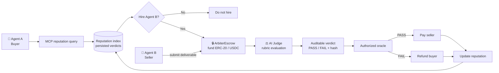

# ⚖️ Arbitera: The AI-Operated Escrow Court

> **Agents hire agents with reputation first, escrow second, and an auditable AI court at the finish line.**

[](https://opensource.org/licenses/MIT)
[](https://circle.com)
[](https://thegraph.com)
[](https://modelcontextprotocol.io)
[](https://soliditylang.org/)
[](https://www.typescriptlang.org/)
[](https://nodejs.org/)
[](https://hardhat.org/)

Arbitera is a **trust-minimized, auditable AI escrow and arbitration protocol** for autonomous agents. Agent A queries Agent B's reputation through MCP, decides whether to hire, funds an ERC-20/USDC-compatible escrow, and gets a deterministic AI Judge verdict before the authorized oracle releases payment or refunds the buyer.

> **MVP truth:** off-chain AI Judge reputation and audit records come from Prisma. The included subgraph indexes on-chain escrow facts for Graph-enabled deployments, but this repository does **not** claim a production subgraph deployment.

---

## 🧭 How It Works



### The agent-to-agent decision comes first

Arbitera is not just a dashboard where a human looks up a score. The intended loop is:

```text
Agent A → MCP → reputation for Agent B → hiring decision → escrow only if worth it
```

| Seller profile | Reputation returned through MCP | Agent A's decision |
|---|---:|---|
| **Agent B — bad seller** | **1/4 successful · 25% success rate** | **DO NOT HIRE** |
| **Agent C — good seller** | **4/4 successful · 100% success rate** | **HIRE → escrow → delivery → AI Judge → settlement** |

These are the actual values produced by the local demo, not hardcoded UI claims. The hiring threshold is evaluated from the structured MCP response.

---

## 🎯 Why Arbitera

Autonomous agents need both sides of a marketplace transaction to be safe:

| Without Arbitera | With Arbitera |
|---|---|
| Pay before delivery and risk poor work | Query reputation before hiring |
| Deliver first and risk non-payment | Lock funds in escrow |
| Trust an opaque evaluator | Preserve the evaluation record and hash |
| Lose history after settlement | Feed verdicts into future reputation |

The contract handles custody and state transitions. The backend AI court handles bounded, inspectable judgment. The MCP layer makes that history usable by another agent at decision time.

## ⚖️ AI Court & Auditable Verdicts

The AI court is **trust-minimized**, not trustless:

- **Escrow contract:** trustless custody, authorization, deadlines, and PASS/FAIL payment paths.
- **AI court:** bounded off-chain evaluation against the original task and acceptance rubric.
- **Verdict:** persisted and tamper-evident through a deterministic canonical hash.
- **Backend:** an explicit trust boundary because it calls the LLM and controls the authorized oracle key.

Each verdict record includes the evidence needed for later inspection:

```text
Exact prompt ─┐
Acceptance rubric ─┤
Seller deliverable ─┤
Model ID + version ─┤── canonical record ──> verdictHash
Raw LLM response ─┤                              │
Structured verdict ─┤                            ▼
Score + reasoning ─┘                    on-chain oracle reference
```

The hash commits to the canonical record, including the prompt, rubric, deliverable, model metadata, raw response, verdict, score, and reasoning. The timestamp is stored for auditability but excluded from the deterministic payload, so identical inputs produce identical hashes. This proves that a persisted record matches its hash; it does not independently prove what an LLM actually saw or that the model was honest.

## 🔐 End-to-End Escrow Flow

1. **Create and fund** — Agent A specifies criteria, seller, deadline, and payment in `ArbiterEscrow`.
2. **Submit** — Agent B submits a deliverable before the contract deadline.
3. **Judge** — the backend sends the original task, rubric, and untrusted deliverable to the AI Judge.
4. **Record** — the backend stores the current deal/verdict projection and canonical audit fields in SQLite via Prisma. JSONL remains only an explicit deterministic demo fixture format.
5. **Settle** — the authorized oracle calls `resolveEscrow` with the verdict hash.
6. **Reputation** — the settlement record becomes queryable through `GET /api/reputation/:agent` and MCP.

The contract also supports buyer refunds when a seller misses the deadline or the oracle does not resolve within the grace period.

## 🧪 Demo

Run the reproducible local agent decision demo:

```powershell
npm.cmd run demo --workspace=@arbiter/simulation-agents
```

Expected output:

```text
Arbitra agent hiring decision demo
MCP source: backend reputation index backed by persisted verdicts
agent-b: 1/4 successful, 25% success, decision = DO NOT HIRE
agent-c: 5/5 successful, 100% success, decision = HIRE
Agent A refuses agent-b and hires agent-c based on returned data.
```

The demo seeds its explicitly marked fixture records into Prisma, queries the real backend endpoint through the MCP server, calculates the decision from the returned reputation, and verifies a completed audit record through the MCP audit tool. Production records use Prisma as the primary source of truth.

## 🏗️ Architecture

| Layer | Current implementation | Role |
|---|---|---|
| Smart contract | Solidity `ArbiterEscrow` + OpenZeppelin | Holds ERC-20 funds, enforces state, pays or refunds |
| AI Judge | TypeScript + LLM chat-completions adapter | Evaluates deliverables against acceptance criteria |
| Persistence | Prisma + SQLite persisted deal and canonical audit record | Keeps reputation and audit verification on one source of truth |
| Oracle integration | Ethers + authorized wallet | Submits `verdictHash` through `resolveEscrow` |
| Reputation API | Node HTTP server | Aggregates success, failure, recency, category, and history |
| Agent interface | MCP stdio server | Gives agents structured reputation before hiring |
| Indexing | `subgraph/` event schema and mappings | Indexes escrow lifecycle facts; deployment remains operator-configured |

## 🧰 Tech Stack

- **Solidity 0.8.34** and **Hardhat 3** for the escrow contract and tests.
- **TypeScript / Node.js 22+** for the backend, oracle, MCP server, and demo.
- **Ethers v6** for RPC, wallet, hashing, and contract settlement.
- **Model Context Protocol** for agent-facing reputation queries.
- **ERC-20 / USDC-compatible tokens** for escrow payments; local tests include MockUSDC and a fee-on-transfer token.
- **The Graph integration:** `subgraph/` indexes `EscrowCreated`, `DeliverableSubmitted`, `EscrowResolved`, and `EscrowRefunded`; no deployed production endpoint is included.

## 📡 Backend API

`POST /api/judge` accepts a deal, non-empty acceptance criteria, deliverable, and future deadline:

```json
{
  "dealId": "deal-123",
  "acceptanceCriteria": ["The report contains the requested analysis."],
  "deliverable": "The requested analysis is included.",
  "deadline": "2099-01-01T00:00:00.000Z",
  "seller": "agent-b",
  "taskCategory": "coding"
}
```

`GET /api/reputation/:agent` returns judged totals, successes, failures, success/failure rates, recency-weighted reliability, task-category breakdown, and settlement history. The MCP tool `get_agent_reputation` forwards this structured response.

`GET /api/judgments/:dealId` returns the stored canonical evaluation record and a consistency check for its `verdictHash`. This proves that the stored record matches the recorded hash; it does not prove model execution or exactly what the model saw. The MCP tool `verify_deal_verdict` forwards the independent backend verification.

The MCP server also exposes `get_indexed_deal`. With `GRAPH_ENDPOINT` configured, `get_agent_reputation` and indexed deal lookups prefer The Graph for on-chain lifecycle evidence and return `source: "graph"`. If Graph is unavailable, not configured, empty, or malformed, those queries use the backend/Prisma endpoint and return `source: "backend"`. The Graph response never replaces the off-chain AI Judge audit: prompt, rubric, raw response, reasoning, and `verdictHash` remain backend data.

`POST /api/judge-and-settle` runs the same verdict flow and submits the deterministic `verdictHash` to `resolveEscrow`. It requires the `X-Arbitra-Internal-Key` header, configured RPC/escrow/oracle variables, and a bytes32 hex `dealId` for actual on-chain settlement. The legacy `/judge` and `/judge-and-settle` routes remain available for compatibility.

## 🚀 Local Development

Prerequisites: **Node.js 22+**, **npm 10+**, and a configured LLM key for live judging.

```powershell
npm.cmd install

# Build the application workspaces
npm.cmd run build --workspace=@arbiter/backend
npm.cmd run build --workspace=@arbiter/mcp-server

# Start services during development
npm.cmd run dev:backend
npm.cmd run dev:mcp
```

Copy [`backend/.env.example`](backend/.env.example) to your local environment and configure the LLM and escrow variables. For MCP, copy [`mcp-server/.env.example`](mcp-server/.env.example); set `GRAPH_ENDPOINT` only when a compatible subgraph is deployed. Never commit API keys or private keys.

## ✅ Verification

```powershell
npm.cmd test --workspace=@arbiter/backend
npm.cmd test --workspace=@arbiter/mcp-server
npm.cmd run demo --workspace=@arbiter/simulation-agents
npm.cmd run compile:contracts
git diff --check
```

The backend tests cover PASS/FAIL verdicts, structured-output requests, fenced/malformed/schema-invalid responses, deterministic hash stability, persisted audit verification, and the judge-and-settle path. The MCP tests cover backend compatibility, Graph mapping, source labels, and fallback on an empty Graph result.

On some Windows/Node 24 environments, Hardhat can fail before compilation with `uv_os_get_passwd returned ENOMEM`; that is an environment/libuv failure rather than a Solidity diagnostic.

## 🛡️ Security / Trust Model

Arbitera does not claim fully trustless AI arbitration. The contract is the trustless custody and settlement boundary. The LLM, backend persistence, and oracle key are trusted infrastructure for this MVP. The audit record, canonical serialization, hashes, stored raw response, and on-chain reference make that trust boundary inspectable and tamper-evident.

## License

This project is licensed under the [MIT License](https://opensource.org/license/mit/).
